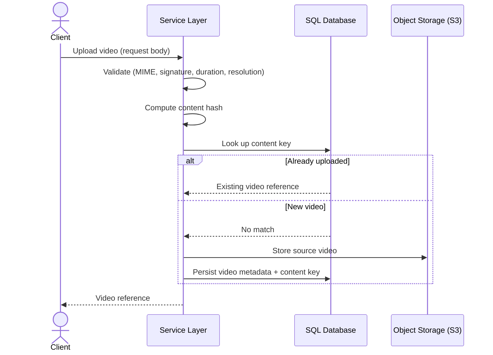
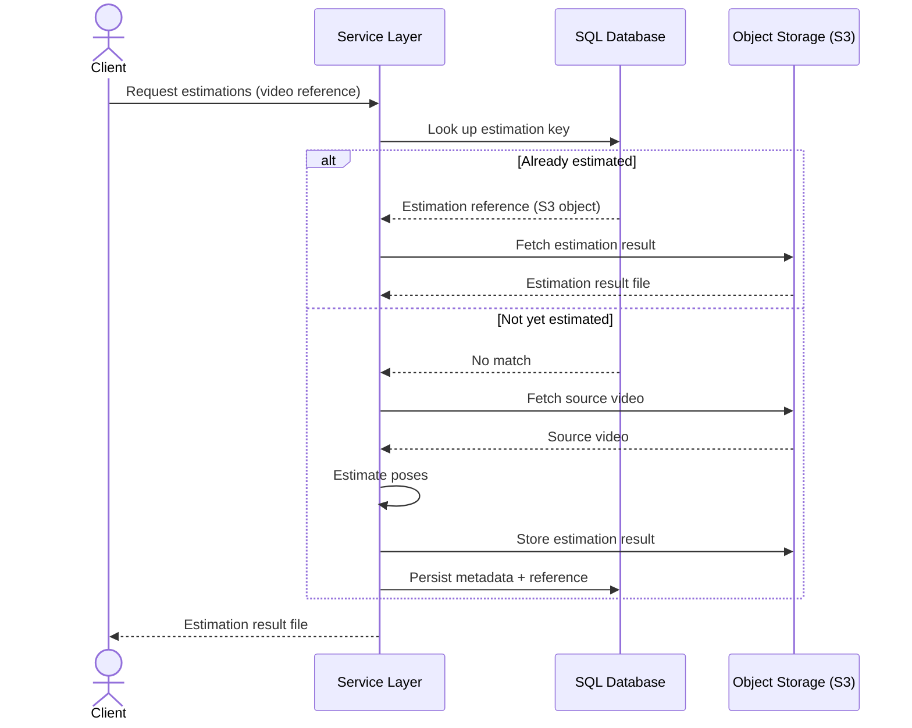
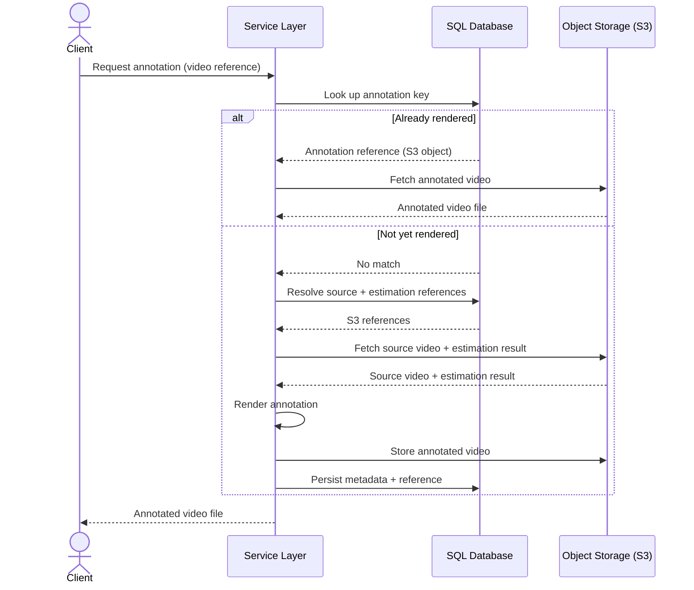

# I. Human Pose Estimation Service: Conceptual Overview

> *This document describes the high-level conceptual architecture of the Human Pose Estimation Service.*

## Task

When I started this project, I was given a concrete objective: expose the existing `ensam3d_inference` as a production-grade REST API service — a managed backend for distributed 3D human pose estimation, wrapping the package with video ingestion, GPU worker orchestration, annotated visualization rendering, and persistent artifact storage. Before selecting a communication protocol, defining the API schema, or committing to any concurrency model, I first needed to formalize exactly what this service must do — and, just as importantly, the properties it must satisfy. I captured this as two sets of requirements: functional requirements, describing *what* the system produces, and non-functional requirements, describing *how* it must behave.

**Functional Requirements**

| ID | Requirement |
|------|-------------|
| **FR‑1** | As input, the system accepts a video stream submitted over the network. |
| **FR‑2** | The system performs 3D pose estimation over the submitted video by delegating to `ensam3d_inference`, preserving its input–output contract end-to-end — strict 1:1 index alignment, at most one primary subject per frame, and a per-frame result of either a structured object with 3D keypoints and their 2D projections or `None` — without reinterpreting or altering it. |
| **FR‑3** | As output, the system returns the resulting sequence of pose estimations. |
| **FR‑4** | If requested, the system produces an annotated video derived from the estimation sequence, with model predictions rendered as overlays onto the original frames for visual validation. |
| **FR‑5** | As output, if requested, the system additionally returns the annotated video. |
| **FR‑6** | The system retains the produced outputs — the pose estimations and, when generated, the annotated video — as a persistent record of completed work, so that a later request for the same work can be served from storage instead of re-running pose estimation or annotation. |

**Non-Functional Requirements**

| ID | Requirement |
|-------|-------------|
| **NFR‑1** | The client interacts with the system exclusively through network requests and remains fully decoupled from the execution environment. |
| **NFR‑2** | The system must support concurrent access: a request submitted by one client must not block another client from submitting or retrieving results simultaneously. |
| **NFR‑3** | No hard constraints are placed on deployment hardware — in particular on *aggregate* memory and the number of concurrent processes — leaving room for a resource-intensive execution model that runs heavier components as separate dedicated processes. |
| **NFR‑4** | The *per-unit-of-work* peak memory consumption must remain bounded and predictable, independent of input video duration and of the number of requests processed concurrently. |
| **NFR‑5** | Expensive resources — in particular the GPU/VRAM occupied by the resident `ensam3d_inference` model weights — must be allocated only to the components that actually require them. |
| **NFR‑6** | Components with distinct resource profiles must scale independently: each component type can be replicated to match its own workload — adding GPU-bound inference capacity or CPU-bound post-processing capacity separately — without forcing unrelated components to scale with it.
| **NFR‑7** | The infrastructure dependencies always run in containers, while the service itself must run either as local code against them (for fast development iteration) or fully containerized alongside them (for deployment) — with no manual rework when switching between the two modes. |
| **NFR‑8** | The codebase must remain straightforward to read and reason about: a developer opening it should be able to form a correct mental model of what each part does and how the parts fit together, without disproportionate effort
| **NFR‑9** | Malformed, non-video, or otherwise invalid inputs must be rejected at the system boundary, before they are persisted or admitted into the processing pipeline. |
| **NFR‑10** | Already-completed work must never be recomputed: a request for an already-produced result is served from the persistent record (FR‑6), and a fresh submission whose video and parameters match work already done returns that existing result rather than producing a duplicate. |
| **NFR‑11** | Each component must operate with the minimum privileges its function requires, so that a leaked or compromised credential exposes only the operations it was granted — not the underlying infrastructure as a whole. |
| **NFR‑12** | Client-facing authentication, authorization, and rate limiting are outside the scope of this system. |

## First Decisions

Based on the requirements above, I made the following foundational design decisions. Each one is traced back to the requirement that motivates it.

| Decision | Rationale |
|----------|-----------|
| **HTTP as the transport protocol** | **NFR‑1** requires the client to interact with the service purely through network requests, so a bidirectional, request–response protocol is needed. HTTP satisfies this natively and is universally supported by clients, load balancers, API gateways, and monitoring tools. gRPC would offer stricter contracts and binary performance, but at the cost of operational complexity (proto management, code generation) not justified at the current scale; WebSocket or raw TCP would require custom framing, reconnection, and error handling, adding development cost without proportional benefit — and both work against **NFR‑8** by making the wire interaction harder to read and reason about. |
| **Plain HTTP, with TLS terminated at the infrastructure perimeter** | Although HTTPS is the de facto standard for public-facing services, in a microservice architecture transport-layer security (TLS termination) is typically enforced at the perimeter — not inside each service. Per **NFR‑12**, client-facing security is out of this service's scope, so terminating TLS here would only add certificate lifecycle overhead (issuance, rotation, validation) with no security benefit, since client-facing encryption is already handled upstream. Speaking plain HTTP keeps the service simple to deploy, test, and debug, which directly serves **NFR‑7** (identical local and containerized runs, no certificate wiring to switch between modes) and **NFR‑8** (one less moving part to understand). |
| **REST as the API architectural style** | Given HTTP as the transport, REST is adopted as a deliberate stylistic choice rather than a default. The system's outputs are a natural fit for a resource model: **FR‑6** defines pose estimations and annotated videos as persistent records of completed work, and REST expresses exactly this — durable, addressable resources identified by URIs and manipulated through HTTP's standard methods, where retrieving a prior result (**NFR‑10**) is a plain `GET` on its resource. This uniform, convention-driven interface keeps the contract predictable and low-friction for clients (**NFR‑1**) and easy for a developer to open and understand without bespoke semantics (**NFR‑8**). RPC-style designs would re-expose internal procedures rather than resources, eroding that uniformity, while GraphQL's flexible query layer solves a problem this service does not have — a small, fixed set of resources gains nothing from it and pays in added server-side complexity. |
| **A set of resource-oriented endpoints rather than a single catch-all operation** | The resource model adopted above is exposed as several distinct endpoints, each acting on a specific resource, instead of one general-purpose operation that does everything. Each resource the system owns — a submitted video, its pose estimations, an annotation — is addressed and acted on independently: submitting work, retrieving estimations, and requesting or fetching an annotation are separate operations on separate resources, not modes of one overloaded call. This follows directly from REST and keeps each operation's contract narrow and self-describing, so a client (**NFR‑1**) and a developer reading the code (**NFR‑8**) can reason about one endpoint without untangling the behavior of all the others. Collapsing everything behind a single endpoint would re-create exactly the kind of mode-switching, branch-heavy interface the resource decomposition exists to avoid. The asynchronous request lifecycle introduced later reinforces this separation — accepting work and delivering its result become necessarily distinct calls — but the decomposition already holds on REST grounds alone. |
| **Video uploaded via the request body, not via a direct object-storage URL** | Clients submit the source video in the request body rather than receiving a presigned URL to write directly to object storage. Direct-to-storage upload would bypass the service boundary, and with it the validation step below and any future upload tracking. Routing ingestion through the API keeps every byte under the service's control before it reaches storage, preserving the single-boundary guarantee of **NFR‑1** and making the validation required by **NFR‑9** enforceable in the first place. |
| **Input validation at the service boundary** | Since **NFR‑1** makes the service the sole point of entry, the boundary is the only place where input integrity can be enforced. Accepting arbitrary files unchecked is a security risk (malware, non-video payloads) and wastes storage and compute on inputs that will fail downstream anyway. The service validates MIME type, file signature, duration, and resolution *before* persisting anything, so that only well-formed video ever enters the pipeline — satisfying **NFR‑9**. |
| **Content-addressed keys with a pre-creation existence check** | To satisfy **NFR‑10**, every resource is identified by a deterministic key derived from its content: ingestion is keyed on the content hash of the uploaded file, while estimation and annotation are keyed on a canonical hash of their input parameters. Before creating a record, the service checks whether a matching key already exists; on a match it returns the existing artifact (**FR‑6**) immediately, without re-running estimation or rendering and without writing a duplicate. |
| **Two persistence backends: a SQL database and S3-compatible object storage** | The content-addressed scheme above needs somewhere to keep each hash and the links it implies — a source video, the estimations derived from it, an annotation — together with per-request metadata. These could be attached as per-object metadata on the blobs themselves, co-located in object storage. But that metadata is fixed at upload time and immutable thereafter. Also it is addressable only by the object's own key: there is no way to query across objects or to join a request to its artifacts without listing the whole bucket and inspecting each entry one by one. The existence checks of **NFR‑10** and any lookup spanning related records would degrade into exactly that listing-and-scanning.   The system therefore splits persistence by the role of the data rather than by what produces it. All payload files — the uploaded source video, the pose-estimation results, and the rendered annotated video (**FR‑2**, **FR‑3**, **FR‑5**) — are written to S3-compatible object storage. The SQL database holds no payloads at all: only the structured layer that makes those blobs findable — content-hash keys, per-request metadata, and references to the corresponding S3 objects. The records are relational and fixed-schema, queried by key and by relationship, where indexed lookups and referential integrity matter more than the horizontal scale and schema-flexibility a NoSQL store would trade them for. Together the two backends give every produced output a durable home (**FR‑6**): the SQL index resolves a request to its artifacts, and object storage delivers them. |

## Communication Flow

With the requirements and foundational decisions established, I translated them into a concrete communication graph. Because the API is a set of resource-oriented endpoints rather than one catch-all operation, the interaction decomposes into three independent exchanges — uploading a video, requesting its pose estimations, and requesting its annotation — each acting on its own resource and sharing the same boundary discipline: validate, content-address, check the stores before running any computation.

**Actors and Components**

| Component | Role | Responsibility |
|-----------|------|----------------|
| **Client** | External consumer of the API | Submits a video and retrieves the resulting estimations and, optionally, the annotated video. |
| **Service Layer** | Single boundary component | Validates input, deduplicates by content hash, runs pose estimation, renders annotations, orchestrates persistence, and delivers responses. |
| **SQL Database** | Structured-data store | Stores the content-hash index, per-request metadata, and references to the artifacts in object storage. |
| **Object Storage (S3-compatible)** | Binary-artifact store | Stores all payload files: the source video, the pose-estimation results, and the rendered annotated video. |

### Flow 1 — Video upload

The client submits the source video in the request body. The service validates it at the boundary, derives its content key, and — unless the same video was already uploaded — stores it and registers it. The response is a reference the client later uses to request estimations or an annotation.

### Flow 2 — Pose estimation request

Given a video reference, the client requests its estimations. If they were already computed, the service resolves the request through the SQL index and returns the stored result file from object storage; otherwise it fetches the source video, runs pose estimation in-process, writes the result file to object storage, registers it in the SQL index, and returns it.

### Flow 3 — Annotation request

Given a video reference, the client requests its annotated video. If it was already rendered, the service resolves the request through the SQL index and returns the stored annotation file from object storage. Otherwise it fetches the source video and the estimation result — both payload files in object storage, the latter assumed already produced via Flow 2 — renders the overlays in-process, writes the annotated video to object storage, registers it in the SQL index, and returns it.

## Next Steps

The system's design is now fully specified. The natural next move would be to refine it downward — formalizing the domain model, or pinning down each endpoint's request and response schemas. But that detail would be premature: the blueprint above assumes an execution model that breaks down under load.

All three operations carry CPU-bound work inside the request–response cycle, differing only in how long they hold an execution context. Video upload (Flow 1) is dominated by network IO, but it is not purely IO-bound: validation and content hashing read through the entire payload on the CPU — bounded by file size, modest next to inference, yet still real CPU time spent before the response can return. Pose estimation (Flow 2) and annotation rendering (Flow 3) sit at the far end of the same spectrum — heavy, long-running, and CPU-bound by nature. In every case the server execution context stays occupied for the full duration of the work, and a simple async interface cannot help: the cost is real CPU time spent per request, not idle waiting that could be yielded. So under real load execution contexts are exhausted — fastest by Flows 2 and 3, but pushed there by Flow 1's volume as well — requests queue, and latency compounds until the service stalls. That is the direct opposite of the concurrent access required by **NFR‑2**.

So the real next step is not more detail, but a decision on the concurrency strategy.