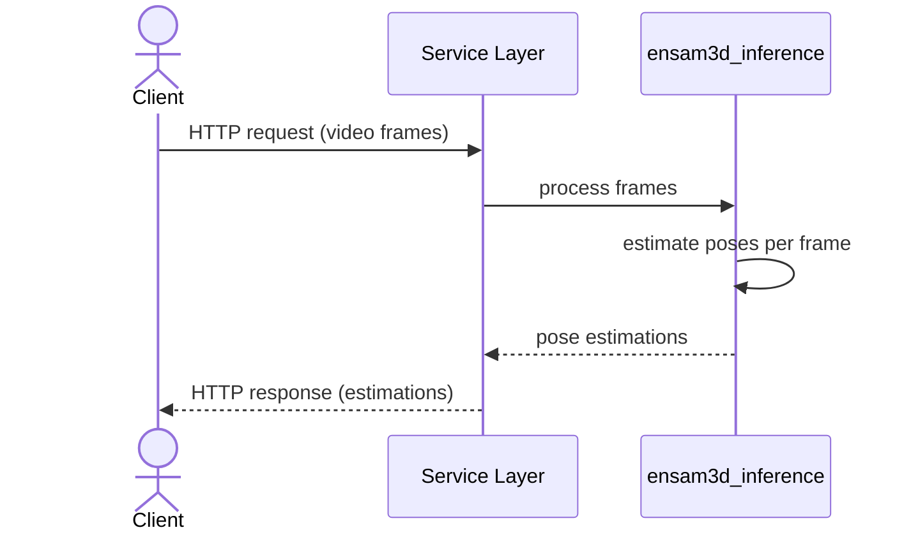

# I. **Human Pose Estimation Service: Conceptual Overview**

> *This document describes the high-level conceptual architecture of the Human Pose Estimation Service.*

## Task and First Decisions

When I started this phase of the project, I was given a concrete objective: build a network-accessible node within a broader client–server architecture, in the spirit of microservices. My responsibility was to design and implement the server side of this communication — a component that would accept incoming video streams from remote clients, process them independently, and return the corresponding results. Before selecting a communication protocol, defining the API schema, or committing to any concurrency model, I first needed to formalize exactly what this node must do — and, just as importantly, what falls outside its scope.

Stripping away all implementation details, I formalized the task as the following input–output contract:

| Component | Description |
| ----------|-------------|
| **Input** | A network request carrying a video stream represented as a sequence of RGB frames. |
| **Output** | A network response carrying a sequence of pose estimations. Each element is either:  - a structured object containing 3D keypoints and their corresponding 2D projections, or  - `None` if no person is detected.  Optionally, an annotated video derived from the estimation sequence, with model predictions rendered as overlays onto the original frames for visual validation. |
| **Contract** | 1. The output length must exactly match the input length.  (i.e. `estimation[i]` always corresponds to `frame[i]`).  2. At most one primary subject is assumed per frame.  3. The client interacts with the system exclusively through network requests and remains fully decoupled from the execution environment.  4. The system must support concurrent access: a request submitted by one client must not block another client from submitting or retrieving results simultaneously.  5. Authentication, authorization, and rate limiting are outside the scope of this system. |

Based on that task definition, I made the following foundational design decisions.

| Decision | Rationale |
|----------|-----------|
| **HTTP as the transport protocol** | The contract specifies that the client interacts with the service through network requests, so a bidirectional, request-response protocol is required. HTTP satisfies this requirement natively and is universally supported by clients, load balancers, API gateways, and monitoring tools. If gRPC were chosen instead, the stricter contracts and binary performance would come at the cost of operational complexity (proto file management, code generation) that is not justified for the current scale. WebSocket or raw TCP would require implementing custom framing, reconnection logic, and error handling, adding development cost without proportional benefit. [^1] |
| **Decomposition into an inference core and a service layer** | The task can be formulated as: *«accept a client request -> produce pose estimations -> send the response»*. The task can be separated into two independent logical concerns:  1. **The inference core** (which is purely responsible for processing frames and producing pose estimations) and  2. **The service layer** (which is purely responsible for the operational environment — accepting requests, managing job lifecycle, enforcing concurrency, and sending responses to clients).   Since neither concern affects the internal logic of the other, the two parts can be designed and reasoned about independently rather than as a single large interconnected problem. |
| **`ensam3d_inference` as the inference core** | The inference core requirements are fully satisfied by the existing `ensam3d_inference` package, which was designed and implemented precisely for this task: high-throughput 3D human pose estimation in video streams with at most one primary subject per frame. This allows the project to focus exclusively on the service layer, with no need to redesign or reimplement the estimation pipeline. Moreover, since the package is distributed via PyPI, it can be installed as a standard dependency, and no inference source code is introduced into the project codebase. |

[^1]: While HTTPS is the de facto standard for public-facing web services, transport-layer security (TLS termination) in a microservice architecture is typically enforced at the infrastructure perimeter — such as an API Gateway, Ingress controller, or Service Mesh (e.g., Istio). Implementing HTTPS directly within the service would introduce unnecessary certificate lifecycle management overhead (issuance, rotation, validation) without providing meaningful security benefits, as client-facing encryption is already handled upstream. Therefore, plain HTTP is used to keep the service simple to deploy, test, and debug, deferring security and authentication concerns to the infrastructure layer.

## Communication Flow

With the task constraints and foundational decisions established, I needed to translate them into a concrete communication graph. I organized the flow as a staged interaction, where a client request passes through the service layer to the inference core, is processed, and finally returned to the client as a structured response. The inference core handles per-frame processing — including graceful handling of frames with no detected persons — ensuring the contract's invariant of strict 1:1 index alignment between input and output sequences is preserved.

**Actors and Components**
- **Client** — external consumer of the API, submitting video streams and retrieving results.
- **Service Layer** — HTTP-facing component responsible for request validation, job lifecycle management, and result delivery.
- **ensam3d_inference** — the inference core, processing frames and producing pose estimations.

The service layer acts as an orchestration boundary: it accepts incoming requests, coordinates with the inference core, and returns results to the client. When visualization is requested, the service layer applies rendering overlays to the original frames using the estimation sequence, producing an annotated video alongside the structured pose data.

## Next Steps

With the communication contract, architectural boundaries, and the strict separation between the inference core and the service layer established, the conceptual foundation of the system is complete. The high-level interaction blueprint presented above intentionally abstracts away the complexities of concurrent request handling to focus purely on the input-output contract and component responsibilities.

However, a fundamental conflict emerges when mapping this conceptual blueprint to real-world execution constraints. The contract strictly requires concurrent access — the structural ability of the service to deal with multiple client requests simultaneously via OS-level multitasking and thread pools. At the same time, 3D pose estimation on high-resolution video streams is computationally expensive and heavily relies on blocking GPU I/O. 

If the service layer were to invoke the inference core synchronously within a single HTTP request-response cycle, the blocking wait on the GPU would tie up the CPU's execution context. The server's worker pool would be quickly exhausted, leading to thread starvation. This directly violates the concurrency requirement, causing cascading timeouts for subsequent clients. Decoupling the request lifecycle from the processing lifecycle is therefore not merely an architectural preference, but a strict requirement to maintain the structural concurrency of the HTTP layer and prevent resource exhaustion.

To resolve this, the system must decouple request acceptance from result delivery, shifting from a blocking execution model to an **asynchronous request-reply pattern backed by a job-queue execution model**. This shift inevitably introduces a new set of engineering challenges: how to track job lifecycles, where to buffer incoming video payloads, and how to persist and serve the resulting estimations without blocking the network layer.

The next document addresses these exact challenges, defining the concrete state management, storage requirements, and job-queue mechanics required to implement this execution model.