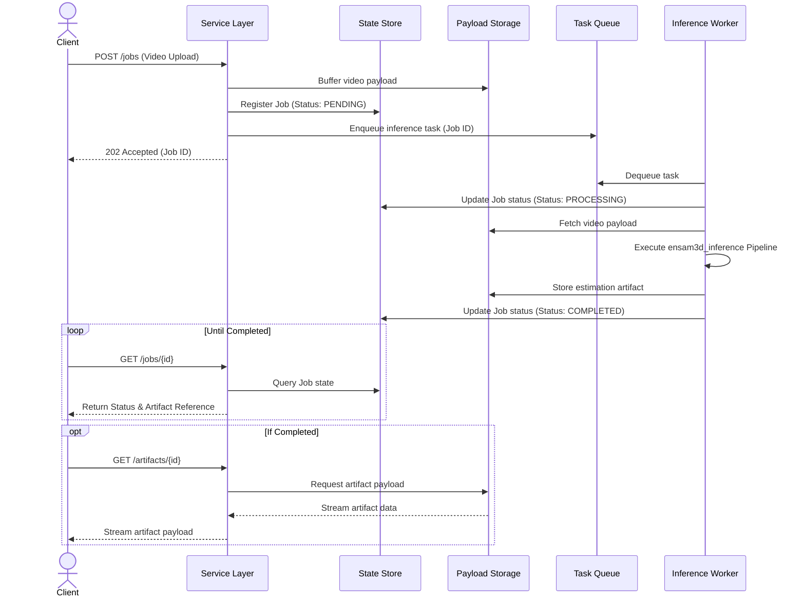

# II. **Runtime Architecture**

> *This document defines the concrete runtime execution model, concurrency strategies, and job lifecycle orchestration of the Human Pose Estimation Service.*

## Overview

The Conceptual Overview established the system's boundaries, the strict separation between the stateless inference core and the HTTP-facing service layer, and the decision to use plain HTTP as the transport protocol. However, that conceptual blueprint intentionally abstracted away the physical realities of execution. 

The primary engineering challenge now is mapping a stateless, synchronous communication protocol (HTTP) onto a highly heterogeneous, long-running workload: the service must simultaneously handle thousands of lightweight network connections, orchestrate background tasks, and execute computationally intensive, memory-bound GPU operations. A monolithic execution model would inevitably lead to resource starvation, where network IO blocks GPU inference, or where a single corrupted video frame crashes the entire API server.

To resolve this, the runtime architecture is decomposed into isolated execution contexts, each optimized for its specific workload profile, communicating exclusively through asynchronous message passing and shared persistent storage.

## Asynchronous Communication Pattern

Before defining the low-level concurrency primitives, we must first resolve a fundamental conflict between the chosen transport protocol and the workload characteristics. HTTP is inherently synchronous, but 3D pose estimation on video streams is computationally expensive and time-consuming. To reconcile this mismatch without violating the concurrency contract, the following communication pattern was adopted:

| Decision | Rationale |
|----------|-----------|
| **Deferred result retrieval (Submit-and-Poll pattern)** | The contract established in the Conceptual Overview states that *«a request submitted by one client must not block another client»*. Neural inference on a video can take minutes, far exceeding typical HTTP connection timeouts or API Gateway limits. If a synchronous request-response pattern were used, clients would be forced to hold connections open for extended periods, making the system fragile and violating the concurrency requirement. By accepting the job, immediately returning a job identifier, and letting the client poll for results, the system decouples request latency from processing latency and satisfies the concurrency contract. |

This architectural decision dictates the high-level execution lifecycle: the system cannot process requests inline; it must implement an asynchronous job queue mediated by persistent storage.

## Concurrency Model

Given the mixed workload profile — heavy GPU-bound inference, predominantly IO-bound request handling, and short CPU-bound serialization tasks — a single concurrency model cannot efficiently serve all execution contexts. The system employs a three-tier concurrency architecture, where each layer uses the concurrency primitive best suited to its dominant workload characteristics.

| Layer | Concurrency Model | Scope | Rationale |
|-------|-------------------|-------|-----------|
| **Inference Workers** | Process-based | GPU/CPU-bound | Each inference job runs in an isolated OS process with its own CUDA context and Python interpreter. This design was chosen over threading or async execution for four reasons:  1. **GPU memory isolation**: Each worker maintains its own CUDA context and VRAM allocation. A memory leak, OOM condition, or corrupted GPU state in one job cannot destabilize concurrent jobs — the failure is contained within a single process.  2. **Crash isolation**: Catastrophic failures (segfaults in C++ extensions, driver errors, corrupted video decoders) terminate only the affected worker. The task queue detects the failure and requeues the job; other workers and the API layer remain unaffected.  3. **No GIL contention**: PyTorch inference involves both CPU-side tensor preparation and GPU-side kernel execution. Threading would serialize the CPU portion across jobs due to Python's Global Interpreter Lock, negating any concurrency benefit. Processes bypass the GIL entirely.  4. **Deterministic resource accounting**: Each worker can be assigned explicit CPU affinity, GPU device binding, and strict VRAM limits. This enables predictable capacity planning and simplifies scaling policies (e.g., safely co-locating multiple workers on a single high-VRAM GPU, or enforcing a 1:1 worker-to-GPU ratio for maximum throughput). |
| **Service Layer (Event Loop)** | Coroutine-based | IO-bound | The HTTP API, job lifecycle management, task queue communication, result storage, and client polling are all IO-bound operations that spend most of their time waiting on external systems. Coroutines were chosen over threads or processes for three reasons:  1. **Lightweight resource usage**: Coroutines have negligible memory overhead compared to threads or processes. The service layer must handle thousands of concurrent client connections and polling requests simultaneously; spawning a separate process for each would be prohibitively expensive.  2. **Efficient context switching**: When a coroutine blocks on IO (waiting for the task queue, storage backend, or client response), the runtime immediately switches to another coroutine without OS-level context switching overhead.  3. **Single-threaded execution model**: Since coroutines run within a single thread, there are no race conditions or need for explicit locking when accessing shared service-layer state (job status maps, client subscriptions, queue handles). This simplifies reasoning about the service layer's behavior while still achieving high concurrency for IO operations. |
| **Service Layer (Thread Pool)** | Thread pool executor | Short CPU-bound | Certain operations must execute within the service layer's context but are CPU-intensive enough to block the event loop (e.g., heavy payload serialization/deserialization, video metadata extraction, or computing checksums for artifact integrity). A thread pool executor was chosen over running these tasks inline in coroutines or offloading them to processes for three reasons:  1. **Non-blocking event loop**: CPU-bound work executes in a separate thread, allowing the event loop to continue serving other coroutines (accepting new requests, handling polling) while serialization is in progress.  2. **Appropriate isolation level**: These tasks are short-lived (milliseconds) and do not carry the risk of memory corruption or GPU resource exhaustion that would justify full process isolation. A thread pool provides concurrency without the operational complexity of managing additional processes.  3. **Lower overhead than processes**: Threads share memory with the main process, making context switches faster and avoiding IPC overhead for tasks that must immediately return results to the calling coroutine. |

## Execution Lifecycle

Driven by the Submit-and-Poll pattern defined above, the interaction between the client, the service layer, and the inference workers is strictly asynchronous. A client request never waits for the inference to complete over an open HTTP connection.

### Inter-Component Communication Boundary

While the asynchronous communication pattern resolves the conflict between the client and the service layer, a second architectural boundary must be established internally between the Service Layer and the Inference Workers. 

The Service Layer operates on a coroutine-based event loop optimized for high-concurrency IO, while Inference Workers are isolated OS processes executing blocking, GPU-bound computations. A direct synchronous invocation (e.g., via blocking IPC) from the event loop to a worker would stall the entire service layer, exhausting the execution pool and defeating the purpose of the concurrency model. 

To preserve the non-blocking nature of the service layer and decouple the request acceptance rate from the inference processing rate, the system introduces a **Task Queue** as the primary inter-component communication boundary. The Task Queue acts as an asynchronous decoupling mechanism and durable buffer: the Service Layer enqueues job descriptors and immediately returns control to the event loop, while Inference Workers independently consume tasks at their own processing capacity. 

This decoupled execution requires two additional persistent components to maintain system coherence:

1. **State Store**: A persistent metadata registry to track the lifecycle state of each job (`PENDING`, `PROCESSING`, `COMPLETED`, `FAILED`), enabling the client's polling mechanism.
2. **Payload Storage**: A dedicated buffer for heavy binary artifacts (raw video uploads and serialized estimation results), preventing the Task Queue from being congested with large data payloads.

> **Note**: The Task Queue, State Store, and Payload Storage are architectural roles. The concrete technologies used to implement them are defined in the Domain Model and Dependencies sections.

### Execution Sequence

With these architectural boundaries established, the end-to-end execution lifecycle unfolds as follows:

This lifecycle ensures that the HTTP API remains highly responsive and decoupled from the execution time of the underlying neural network. If an inference worker crashes mid-execution, the task queue's visibility timeout mechanism will automatically requeue the task, and another worker will pick it up, ensuring **at-least-once** delivery and processing guarantees.

## Integration with Inference Core

The `ensam3d_inference` package is fundamentally designed as a stateless, per-frame processing pipeline: there are no temporal dependencies or hidden states carried over between batches. However, a sharp contrast exists between the stateless nature of the *inference logic* and the heavy operational cost of *instantiating the execution environment*. Loading the ViT-H backbone weights into VRAM, allocating CUDA contexts, and preparing tensor shapes are computationally expensive operations that take several seconds.

If the system were to initialize the neural network on a per-job basis, this multi-second overhead would severely degrade throughput and introduce unpredictable latency spikes (cold starts). To amortize this initialization cost, the system leverages the process-based concurrency model defined earlier, employing a **Persistent Pipeline Instance** pattern.

## Stateless Logic, Stateful Process

This pattern resolves the tension between stateless inference and heavy initialization by strictly separating the pipeline's mathematical logic from the worker's lifecycle:

1. **Eager Initialization & Queue Gating**: When an Inference Worker OS process boots, it immediately instantiates the `ensam3d_inference.Pipeline` and loads the pre-trained weights into the assigned GPU. Crucially, the worker **does not register with the Task Queue** until this initialization is fully complete and a GPU warm-up pass has succeeded. This guarantees that no job is ever routed to a worker that is not immediately ready to execute it, eliminating cold-start latency from the client's perspective.
2. **Stateless Task Execution Loop**: Once registered, the worker enters a continuous consumption loop. For every incoming task, it fetches the required video frames from the **Payload Storage**, passes them through the already-resident pipeline, and serializes the output back to storage. Because the pipeline itself maintains no inter-batch state, the worker can safely process tasks from entirely different clients in rapid succession without risk of state leakage or memory accumulation.

By keeping the model resident in VRAM for the entire lifespan of the worker process, the system ensures that the multi-second initialization cost is paid exactly once per worker lifecycle, while the per-frame inference remains strictly stateless and deterministic.

## Next Steps

With the execution contexts, concurrency primitives, and asynchronous communication boundaries established, the runtime architecture is fully defined. The system now has a clear structural blueprint for handling concurrent network connections while safely isolating heavy, blocking GPU computations in dedicated worker processes. 

However, an execution model is only as robust as the data structures it operates on. The architectural roles introduced in the previous section — specifically the **State Store** and **Payload Storage** — require strict schema definitions to ensure consistency, type safety, and predictable serialization between the Service Layer and the Inference Workers. 

To maintain a clear separation of concerns, the system's data architecture is decomposed into two distinct conceptual models:

1. **The Orchestration Model**: Defines the lightweight, transient metadata required to manage the job lifecycle, queue routing, and state transitions (e.g., job identifiers, state machine statuses, timestamps, worker assignments). This model maps directly to the State Store and serves as the control plane of the system.
2. **The Domain Model**: Defines the heavy, persistent binary artifacts and structured estimation results that represent the actual business value of the system (e.g., raw video payloads, 3D keypoints, camera parameters, mesh topologies). This model maps directly to the Payload Storage and serves as the data plane.

The next two documents will formalize the schemas, storage strategies, and serialization formats for these two models. The immediate next step is to define the **Orchestration Model**, establishing the exact state machine and metadata contracts that govern the asynchronous job queue.