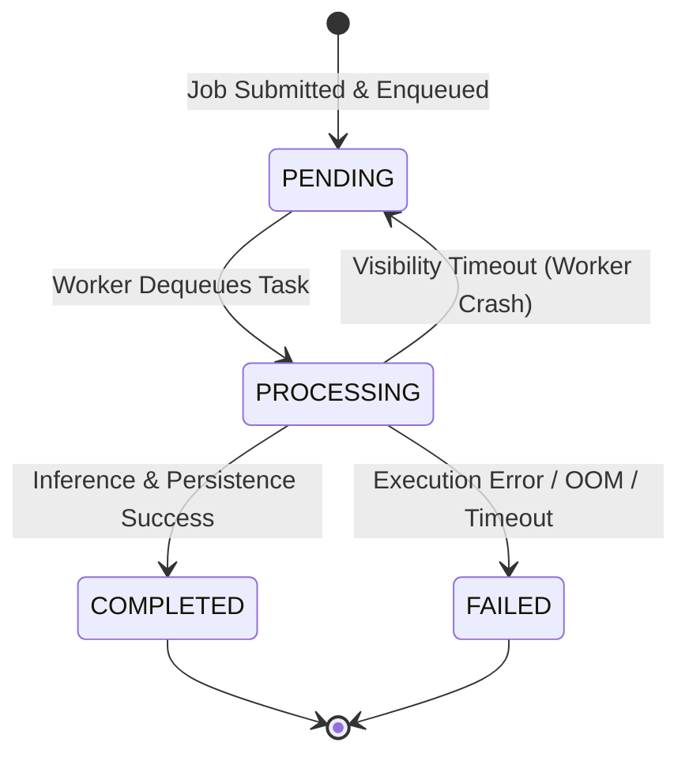

# III. **Orchestration Model**

> *This document defines the ephemeral execution state, job lifecycle state machine, and message routing schemas that govern the asynchronous processing pipeline.*

## Overview

The Orchestration Model serves as the **control plane** of the Human Pose Estimation Service. While the Domain Model (defined in the subsequent document) durably persists the heavy binary artifacts and business metadata (`Video`, `Estimation`, `Visualization`), the Orchestration Model manages the volatile, short-lived execution state of individual processing jobs.

Because the system employs an asynchronous Submit-and-Poll communication pattern, the orchestration layer must satisfy two conflicting operational requirements:
1. **High-Frequency Client Polling**: Clients continuously query the status of their jobs, requiring sub-millisecond read latencies and massive read-throughput without degrading the performance of the primary metadata database.
2. **Reliable Worker Dispatch**: Inference workers must reliably consume tasks, handle catastrophic failures (e.g., GPU OOM, segfaults) gracefully, and support visibility timeouts to ensure *at-least-once* processing guarantees.

To satisfy these requirements, the Orchestration Model is strictly decoupled from the persistent Domain Model and relies on two specialized ephemeral storage components: a **State Store** for tracking job lifecycle metadata, and a **Task Queue** for buffering and routing inference payloads to workers. 

Because the Orchestration Model is strictly ephemeral by design, all terminal states (`COMPLETED`, `FAILED`) are assigned a strict Time-To-Live (TTL). Once a client has retrieved the final status and artifact references, the orchestration metadata is automatically evicted. This prevents unbounded state accumulation in the State Store, ensuring that only the heavy, valuable artifacts remain durably persisted in the Domain Model.

## Job Lifecycle State Machine

Every job submitted to the system transitions through a strict state machine. This state machine is the single source of truth for the client's polling mechanism and dictates the routing logic within the Task Queue.

| State | Description | Trigger |
|-------|-------------|---------|
| **`PENDING`** | The job metadata is registered in the State Store, and the execution payload is buffered in the Task Queue. The client receives the `job_id` and begins polling. | Initial HTTP submission. |
| **`PROCESSING`** | An Inference Worker has successfully dequeued the task, locked it via a visibility timeout, and begun executing the `ensam3d_inference` pipeline. | Worker acknowledgment. |
| **`COMPLETED`** | The inference pipeline finished successfully. The resulting artifacts have been durably persisted to the Domain Model, and their IDs are linked to the job record. **The record is retained for a strict TTL to allow final client polling before automatic eviction.** | Worker success signal. |
| **`FAILED`** | The worker encountered an unrecoverable error (e.g., corrupted video codec, CUDA out-of-memory, invalid parameters). The error trace is persisted in the State Store for client debugging. **Like completed jobs, failed records are subject to a TTL to prevent unbounded state accumulation.** | Worker exception handling. |

## The Message Broker Requirement

The asynchronous execution model established in the previous section introduces a critical architectural component: the **Task Queue**. This queue serves as the decoupling mechanism between the Service Layer (which accepts and validates incoming jobs) and the Inference Workers (which execute the computationally expensive `ensam3d_inference` pipeline).

However, the Task Queue cannot be implemented as a simple in-memory data structure or a direct function call. The operational requirements of the system — particularly the need for reliability, durability, and graceful failure handling — demand a dedicated **message broker** with specific capabilities.

### Why Not Direct Invocation or In-Memory Queues?

Before formalizing the requirements for the message broker, it is necessary to understand why simpler alternatives are insufficient:

| Alternative | Why It Fails |
|-------------|--------------|
| **Direct synchronous invocation** | The Service Layer would block on GPU-bound inference, exhausting the execution pool and violating the concurrency contract. A single slow or failed job would cascade into system-wide unavailability. |
| **In-memory queue (e.g., `queue.Queue`)** | If the Service Layer process crashes or restarts, all buffered tasks are lost, violating the *at-least-once* processing guarantee. Additionally, the queue cannot be shared across multiple Service Layer instances in a horizontally scaled deployment. |
| **Database table as a queue** | While durable, databases are optimized for transactional workloads, not high-throughput message consumption. Polling a database table introduces latency, increases load on the primary metadata store, and lacks native support for visibility timeouts and acknowledgment semantics. |

These limitations make it clear that a purpose-built message broker is not merely an implementation detail, but a fundamental architectural requirement.

### Message Broker Requirements

The message broker must satisfy the following operational requirements to ensure reliable, scalable, and fault-tolerant job execution:

| Requirement | Rationale |
|-------------|-----------|
| **Message durability** | Tasks must persist across broker restarts and process crashes. If the broker fails, no job should be lost; it must be recoverable and reprocessable. This ensures the *at-least-once* delivery guarantee required by the system's reliability contract. |
| **Visibility timeout with acknowledgment** | When a worker dequeues a task, the broker must lock it for a configurable duration (visibility timeout). If the worker crashes or fails to acknowledge completion within this window, the broker must automatically requeue the task for another worker. This prevents jobs from being permanently stuck in `PROCESSING` state due to worker failures (e.g., GPU OOM, segfaults). |
| **Buffering and backpressure** | The broker must absorb burst traffic — situations where clients submit jobs faster than workers can process them. It should buffer tasks without dropping them, applying backpressure to the Service Layer only when capacity is truly exhausted. This decouples the request acceptance rate from the inference processing rate. |
| **Fair dispatch and load balancing** | Tasks must be distributed evenly across available workers. The broker should not assign a new task to a worker that is already processing one, ensuring that no single worker becomes a bottleneck while others remain idle. |
| **Scalability and horizontal distribution** | The broker must support multiple Service Layer instances (producers) and multiple Inference Workers (consumers) operating concurrently. It should allow dynamic scaling — adding or removing workers without disrupting in-flight jobs. |
| **Low-latency polling and consumption** | Workers must be able to consume tasks with minimal latency. The broker should support efficient push or long-polling mechanisms rather than requiring workers to repeatedly query for new tasks, which would introduce unnecessary network and CPU overhead. |
| **Metadata support** | The broker must allow tasks to carry structured metadata (e.g., job ID, priority, submission timestamp) alongside the payload. This metadata is used for routing, logging, and state transitions without requiring a separate database lookup. |

### Architectural Role of the Message Broker

With these requirements established, the message broker assumes a clearly defined architectural role: it is the **asynchronous communication boundary** that enables the Service Layer and Inference Workers to operate as fully decoupled, independently scalable components.

The Service Layer acts as a **producer**: it enqueues job descriptors and immediately returns control to the event loop, maintaining high concurrency for incoming HTTP requests. Inference Workers act as **consumers**: they independently pull tasks from the broker at their own processing capacity, execute the inference pipeline, and acknowledge completion.

This decoupling ensures that:
- The Service Layer remains responsive regardless of inference latency.
- Workers can be scaled horizontally based on GPU capacity and job backlog.
- Failures in one component (e.g., a worker crash) do not propagate to the other.

The concrete technology used to implement this message broker is defined in the Dependencies section. The next step is to formalize the schema of the job descriptors that flow through this broker — the structured metadata that enables routing, state tracking, and result correlation.

## Next Steps

With the job lifecycle state machine, TTL-based eviction policies, and message broker requirements established, the Orchestration Model is fully defined. The system now possesses a robust **control plane** capable of tracking job metadata, routing tasks to isolated inference workers, and guaranteeing *at-least-once* processing through visibility timeouts.

However, the Orchestration Model is intentionally minimalist. It tracks *that* a job exists and *what state* it is in, but it does not store the actual value produced by the system. The core business objective of the service is to transform raw video streams into structured 3D human pose estimations and optional visual overlays. These outputs — along with the input video payloads themselves — are heavy, structured binary artifacts that must be durably persisted, efficiently serialized, and served back to the client upon job completion.

To satisfy these requirements, the system introduces the **Domain Model**, which serves as the **data plane** of the architecture. While the Orchestration Model manages ephemeral execution state subject to strict TTLs, the Domain Model is responsible for the long-term persistence, schema definition, and storage routing of the system's primary business entities: `Video` (input payloads), `Estimation` (structured 3D keypoints, meshes, and camera parameters), and `Visualization` (annotated video overlays).

The next document formalizes the Domain Model. It will define the concrete data schemas, serialization formats, and storage strategies required to reliably exchange heavy binary artifacts between the Service Layer, the Inference Workers, and the external clients.