# IV. Request Lifecycles

> *This document describes the request lifecycle of every API endpoint — how each coordinates the service layer, workers, and storage backends — together with the cross-cutting API conventions shared across them.*

## Scope & API Contracts

This document describes the **request lifecycles** — how each endpoint coordinates the service layer, workers, and storage backends — not the wire-level API contracts. Request and response schemas, field types, and status codes are deliberately omitted here to avoid duplicating a source of truth that would inevitably drift. For the exact contracts, consult the code itself, where every endpoint is fully annotated and documented through inline comments, or [export](../packages/scripts/src/scripts/utils/export_swagger.py) the OpenAPI (Swagger) specification and inspect it in any Swagger viewer (e.g. the online Swagger Editor).

## Architectural Decisions

| Decision | Rationale |
|----------|-----------|
| **Explicit action suffixes for heavy operations** | Strict REST favors noun-only paths (`POST /videos`), but this API uses action suffixes (`/ingest`, `/submit`, `/download`) for operations that involve heavy I/O or background processing. These are genuinely long-running actions rather than plain resource writes, so naming the action is clearer and more honest about what happens than contorting it into a noun. A pragmatic deviation, accepted for readability over REST purity (**NFR‑8**). |
| **Uniform `201` on deduplicated submissions** | When a submission matches existing work, the service returns the already-created resource — still under `201 Created` rather than a distinct "already existed" code. Strictly this misreports whether anything was created, but the deviation is deliberate: it is simpler to implement, and clients are expected to act on the response *body* (the resource and its id), not to branch on fine-grained status codes. The contract stays predictable; only the create/reuse distinction is elided. |
| **Unified, generic error responses** | Per **NFR‑1**, the client is fully decoupled from the execution environment. Leaking internal details (stack traces, library exceptions, class names) would break that decoupling and couple clients to the service's internals. A centralized handler translates every internal exception into one consistent, generic error shape — protecting the internal architecture and giving clients a stable contract to handle regardless of what failed inside. |

## Endpoint Lifecycles

### `GET /health/shallow/`

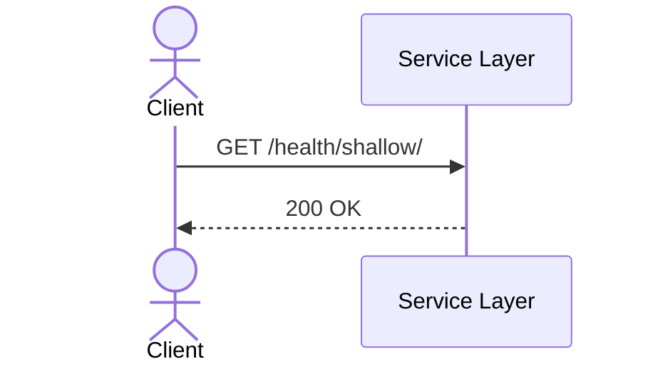

### `GET /health/deep/`

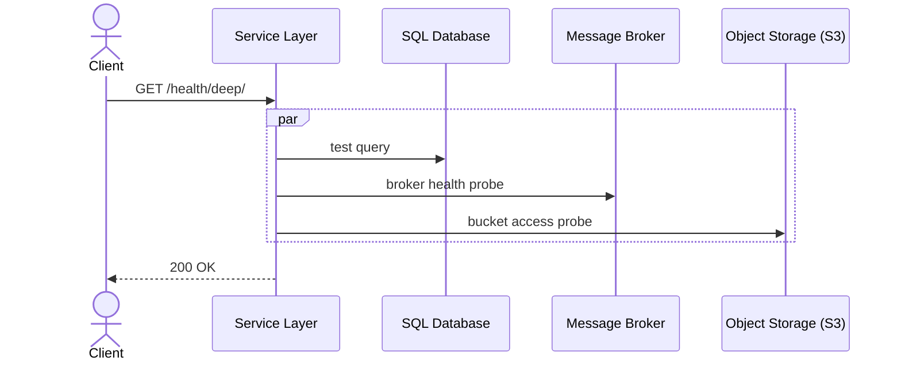

### `POST /videos/ingest/`

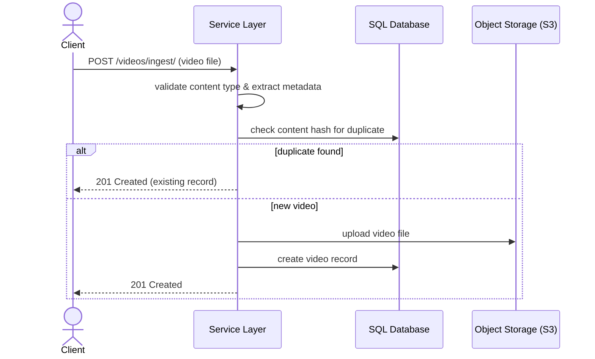

### `GET /videos/`

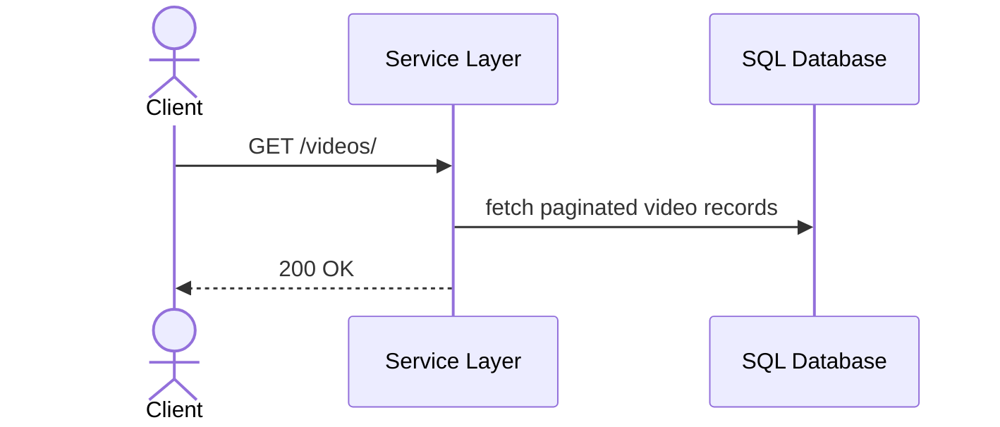

### `GET /videos/{video_id}/`

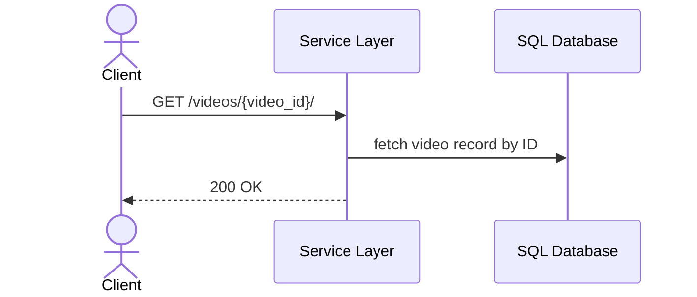

### `GET /videos/download/{video_id}/`

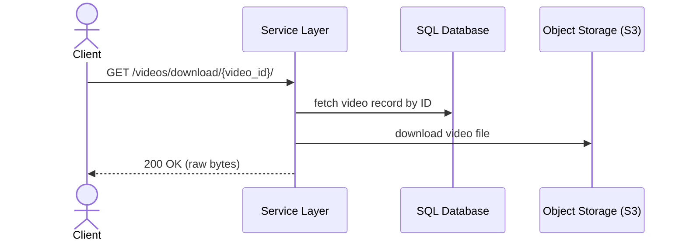

### `DELETE /videos/{video_id}/`

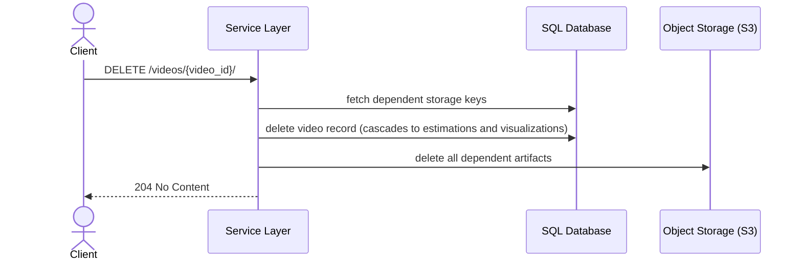

### `GET /tasks/{task_id}/`

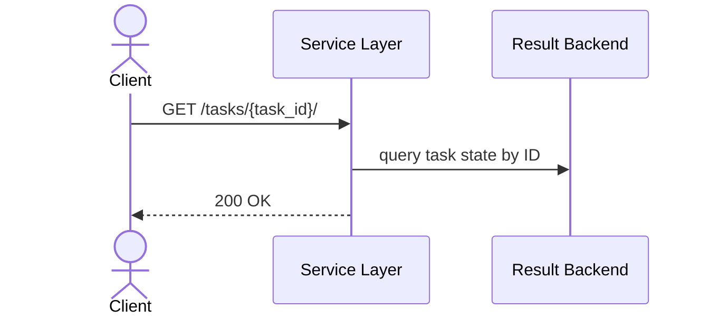

### `POST /estimations/submit/`

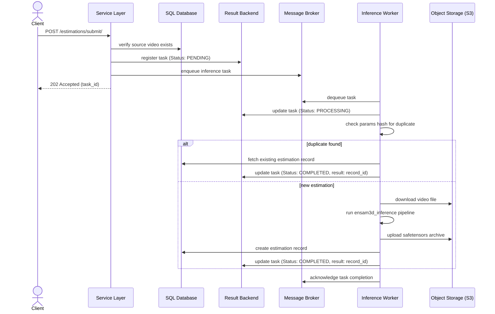

### `GET /estimations/`

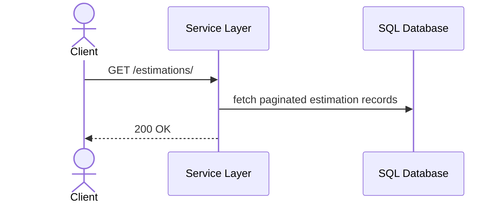

### `GET /estimations/{estimation_id}/`

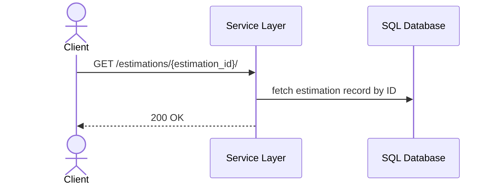

### `GET /estimations/download/{estimation_id}/`

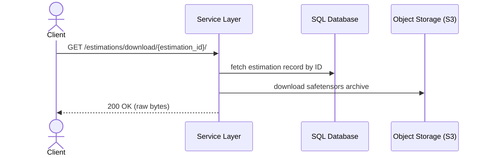

### `DELETE /estimations/{estimation_id}/`

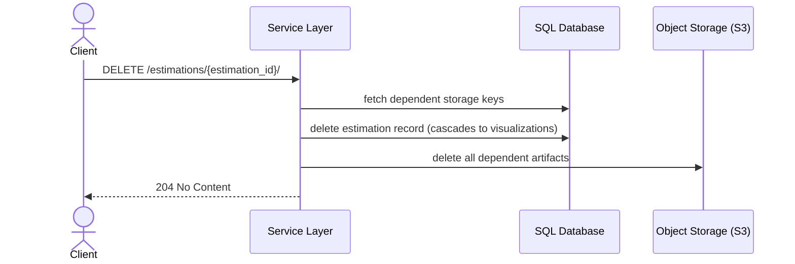

### `POST /visualizations/submit/`

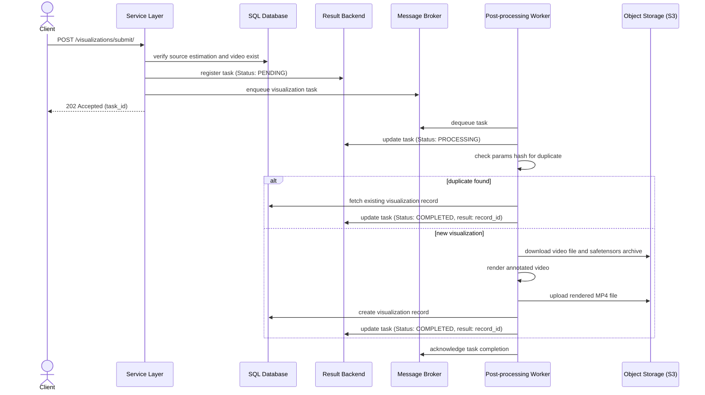

### `GET /visualizations/`

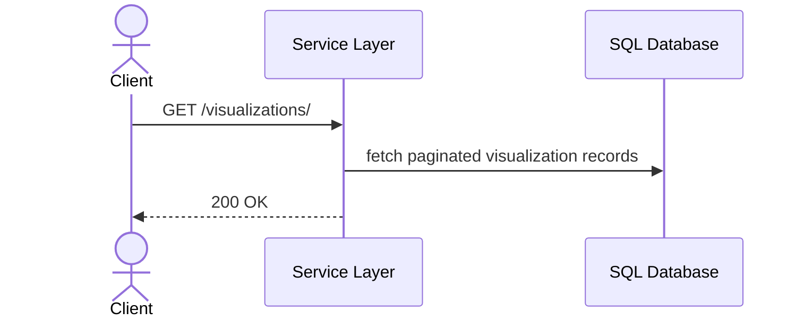

### `GET /visualizations/{visualization_id}/`

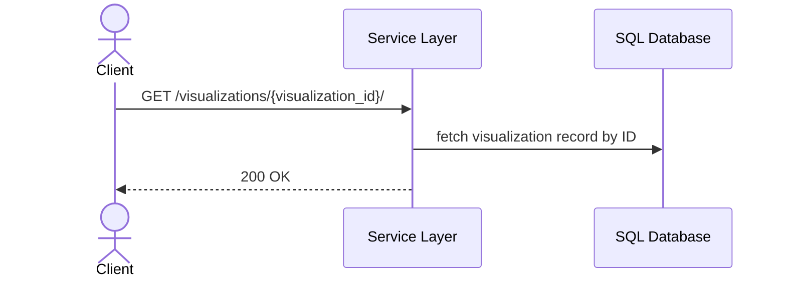

### `GET /visualizations/download/{visualization_id}/`

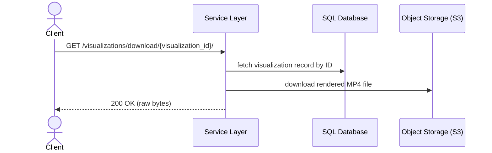

### `DELETE /visualizations/{visualization_id}/`

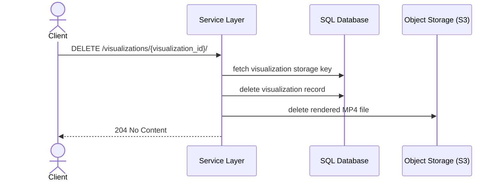