# VII. **Request Flows**

> *This document defines the runtime interaction patterns through sequence diagrams, making the execution flow and inter-component communication explicit for each API operation.*

The following diagrams detail how client requests traverse the service layer, interact with persistent storage, and coordinate with background workers. Each flow demonstrates the strict separation between synchronous HTTP handling (Service Layer) and asynchronous task execution (Workers), as well as the content-addressed deduplication strategy that prevents redundant processing and storage.

## `GET /health/shallow/`

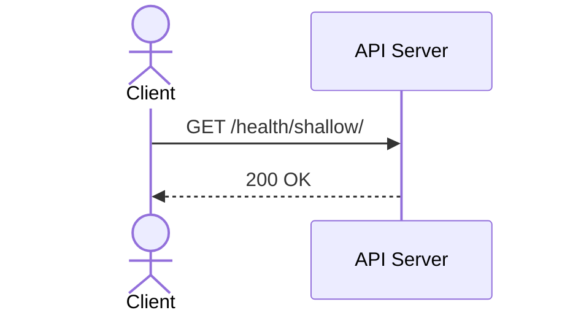

## `GET /health/deep/`

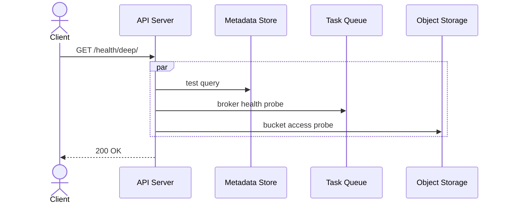

## `POST /videos/ingest/`

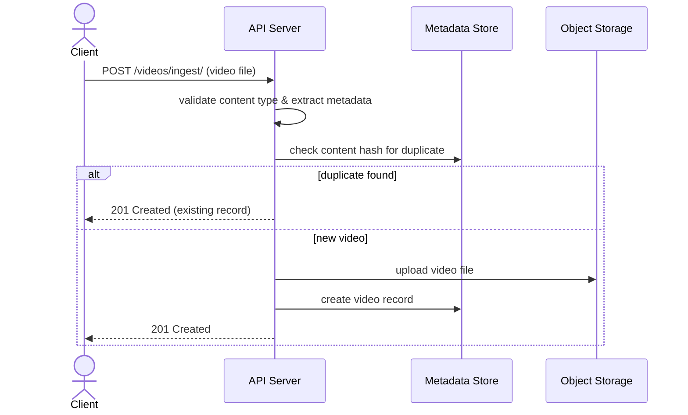

## `GET /videos/`

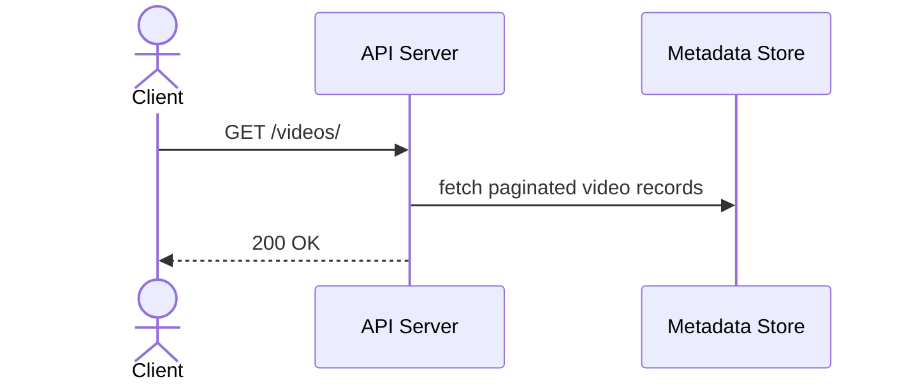

## `GET /videos/{video_id}/`

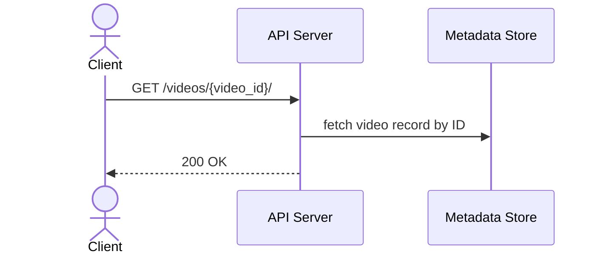

## `GET /videos/download/{video_id}/`

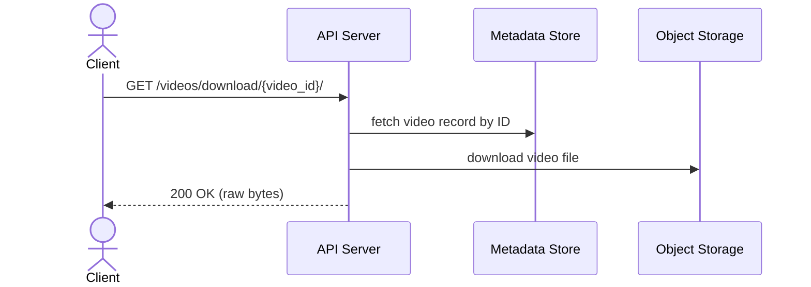

## `DELETE /videos/{video_id}/`

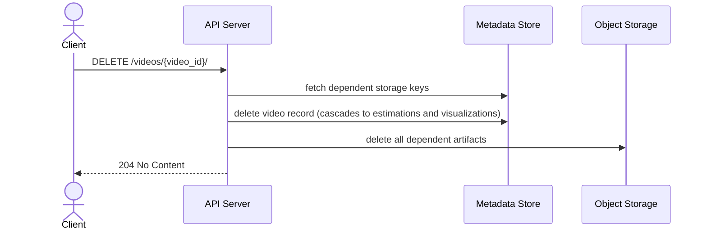

## `GET /tasks/{task_id}/`

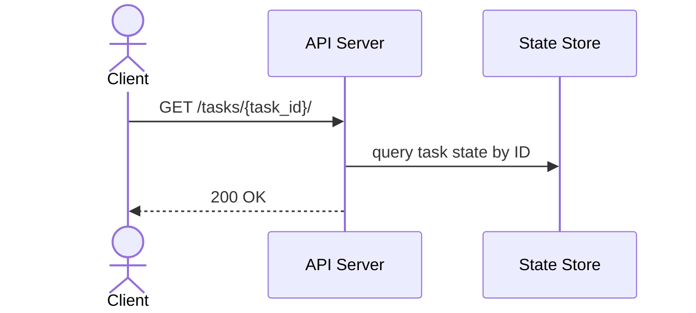

## `POST /estimations/submit/`

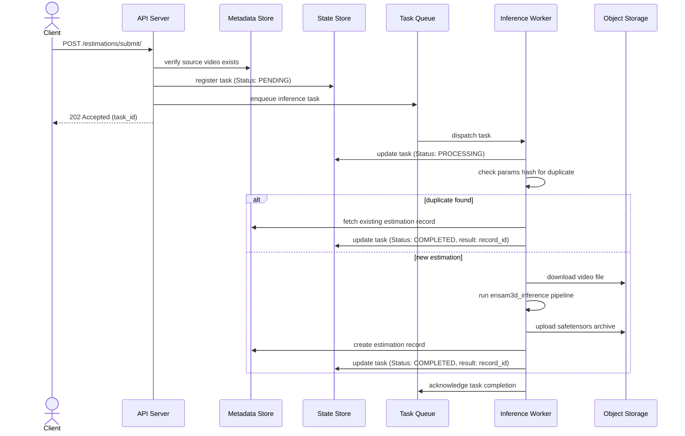

## `GET /estimations/`

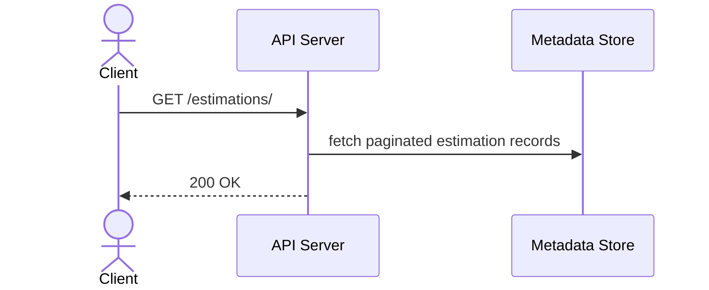

## `GET /estimations/{estimation_id}/`

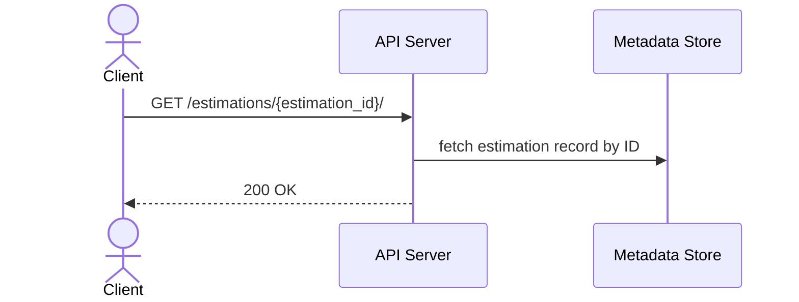

## `GET /estimations/download/{estimation_id}/`

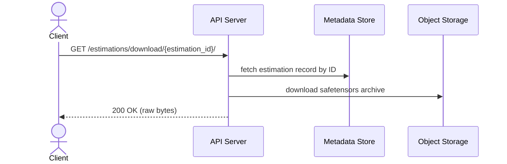

## `DELETE /estimations/{estimation_id}/`

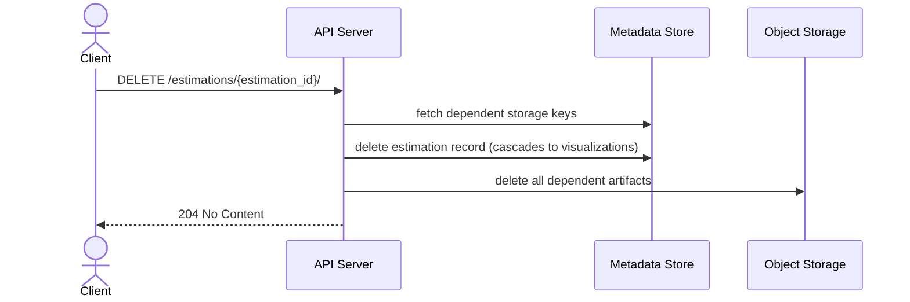

## `POST /visualizations/submit/`

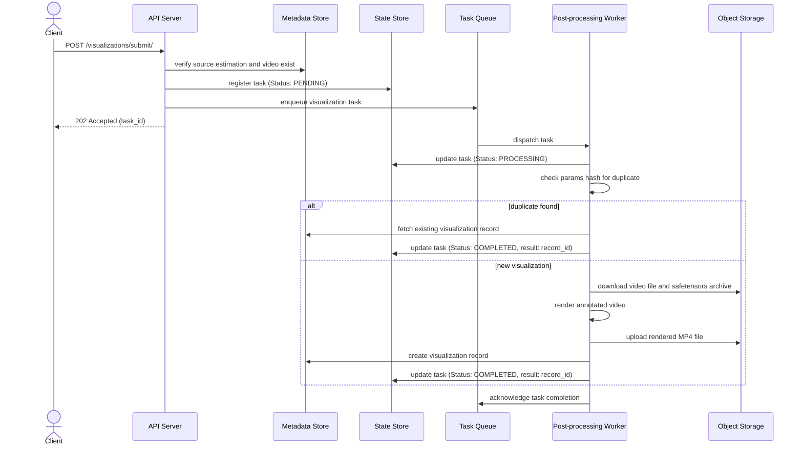

## `GET /visualizations/`

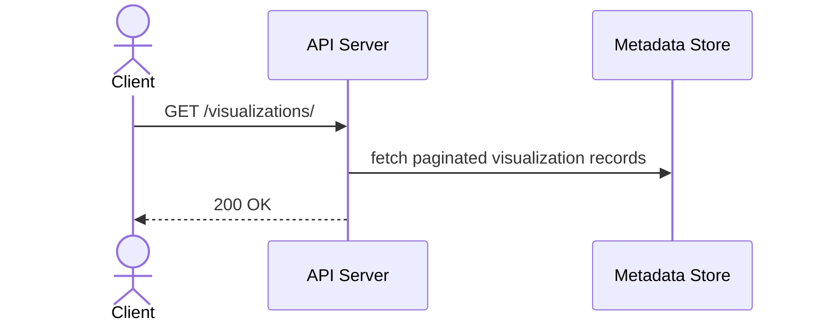

## `GET /visualizations/{visualization_id}/`

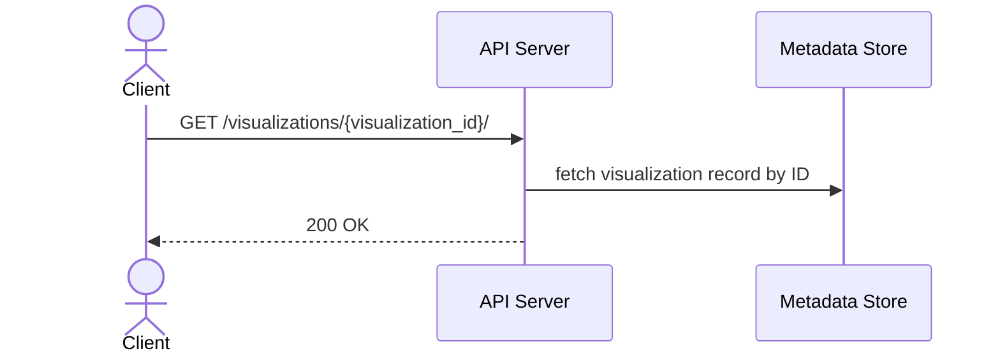

## `GET /visualizations/download/{visualization_id}/`

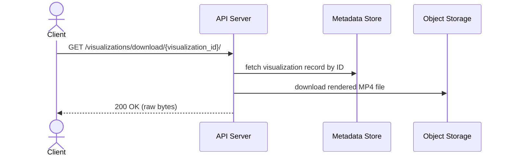

## `DELETE /visualizations/{visualization_id}/`

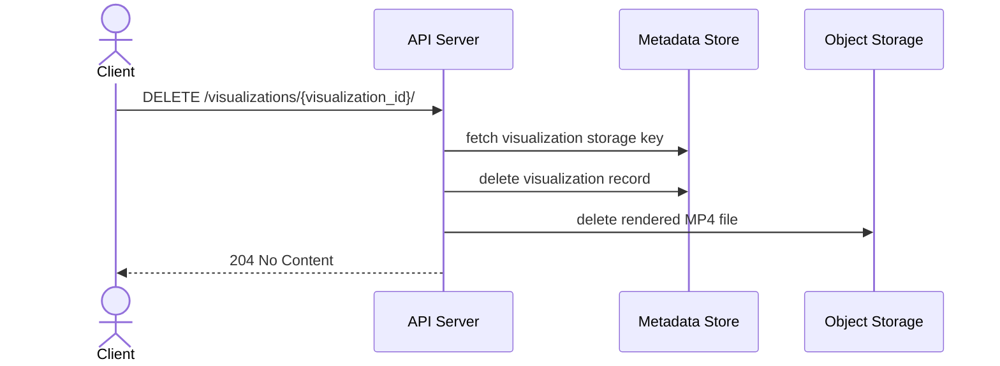

## Next Steps

With the complete runtime interaction patterns formally documented, the Request Flows section is complete. Every API operation now has an explicit sequence diagram showing the exact order of interactions between the client, API server, metadata store, state store, task queue, inference workers, and object storage.

These diagrams serve as the definitive operational specification for the Human Pose Estimation Service. They provide:

1. **Implementation clarity**: Developers can trace the exact execution path for every endpoint, including error handling branches, deduplication logic, and asynchronous task lifecycle management.

2. **Operational observability**: Infrastructure teams can identify which components participate in each flow, enabling targeted monitoring, alerting, and capacity planning.

3. **Debugging reference**: When issues arise in production, these diagrams provide a baseline for comparing expected versus actual behavior, making root cause analysis more systematic.

4. **Testing strategy**: QA engineers can derive integration test scenarios directly from these flows, ensuring that all branches (success paths, duplicate detection, failure modes) are covered.

The documentation now spans the full architectural stack: from high-level conceptual design and runtime concurrency models, through domain entity schemas and API contracts, down to the exact sequence of inter-component messages that execute at runtime.

The next document will formalize the **Dependencies and Technology Stack**, mapping the abstract architectural roles defined throughout this documentation (Task Queue, State Store, Metadata Store, Object Storage) to concrete, battle-tested open-source technologies. This final piece of the architectural puzzle will provide the exact blueprint required to build, deploy, and operate the system in both local development and production environments.