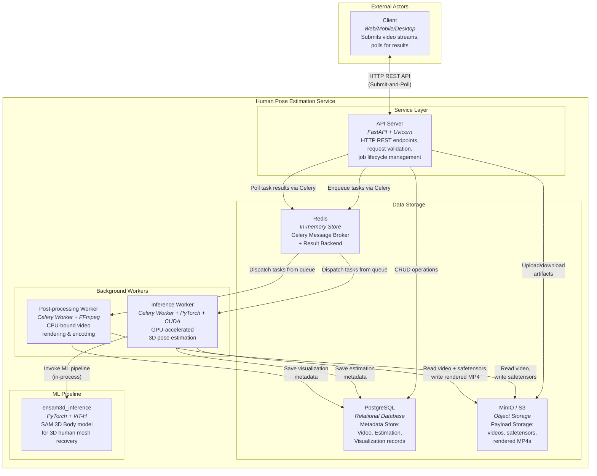

# **`docs/`**

> *This directory contains the full technical documentation for the Human Pose Estimation Service, including the conceptual design, runtime concurrency models, domain schemas, API contracts, execution flows, codebase structure, and dependencies. The documentation is organized to provide a clear, reproducible, and engineering-focused understanding of the system from the network boundary down to the GPU execution context.*

## I. Project Overview

This project is a production-grade, network-accessible microservice designed for high-throughput 3D human pose estimation from monocular video streams. It serves as the orchestration and delivery layer built around the `ensam3d_inference` core, transforming a stateless, per-frame ML pipeline into a robust, asynchronous client-server system.

The service accepts raw video uploads via a REST API, manages the lifecycle of computationally expensive inference and rendering jobs through a distributed task queue, and serves structured 3D estimations and annotated visualizations back to the clients. It is engineered to handle concurrent requests gracefully, isolating heavy GPU workloads from the HTTP event loop, enforcing strict content-addressed deduplication, and maintaining a clear separation between ephemeral orchestration state and durable domain artifacts.

**C4 Container Diagram**

## II. Documentation Overview

This section provides a structured guide to the documentation layout of the service. Each file focuses on a specific layer of abstraction, ranging from high-level conceptual design to low-level deployment and runtime execution.

- To understand the core idea, task formulation, and foundational design decisions, see  
    [01-conceptual-overview.md](01-conceptual-overview.md).

- To review the concurrency strategies, execution contexts, and asynchronous communication patterns, see  
    [02-runtime-architecture.md](02-runtime-architecture.md).

- To understand the ephemeral job lifecycle state machine and message broker requirements, see  
    [03-orchestration-model.md](03-orchestration-model.md).

- To review the core domain entities, relational schemas, and polyglot storage strategies, see  
    [04-domain-model.md](04-domain-model.md).

- To study the engineering decisions governing ingestion, resource isolation, and security boundaries, see  
    [05-engineering-decisions.md](05-engineering-decisions.md).

- To understand the external HTTP interface, resource mapping, and API contracts, see  
    [06-api-design.md](06-api-design.md).

- To review the runtime interaction patterns and sequence diagrams for every API operation, see  
    [07-request-flows.md](07-request-flows.md).

- To analyze end-to-end pipeline latency, parallel processing efficiency, and deduplication speedup across multiple concurrent workloads, see [08-performance-benchmarks.md](08-performance-benchmarks.md).

- To understand the repository layout, module boundaries, and codebase organization, see  
    [09-project-structure.md](09-project-structure.md).

- To review the runtime dependencies, infrastructure services, and technology stack, see  
    [10-dependencies.md](10-dependencies.md).