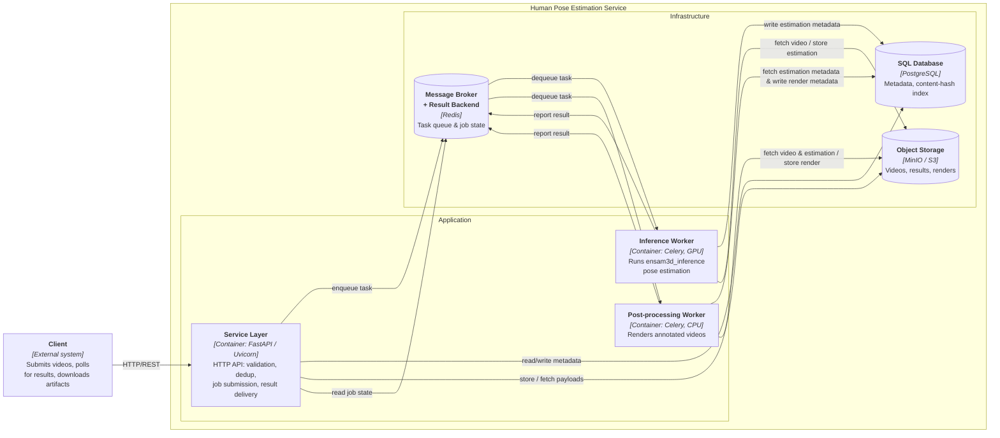

# Human Pose Estimation Service

> *This directory holds the full technical documentation for the Human Pose Estimation Service. This file serves as its entry point: it gives a high-level overview of the service backed by a performance benchmark, then points to the file covering each layer of the system, from conceptual design to empirical performance.*

## I. Project Overview

The Human Pose Estimation Service is a production-oriented REST API that exposes the `ensam3d_inference` engine as a managed backend for distributed 3D human pose estimation. It wraps the inference core with everything an inference library lacks: video ingestion and validation, content-addressed deduplication, asynchronous job execution across isolated GPU and CPU worker pools, annotated-video rendering, and durable artifact storage — all behind a resource-oriented HTTP API where clients submit work and poll for results.

End-to-end performance under concurrent load is summarized below using a parallel-pipeline benchmark: ten videos of mixed resolution and duration submitted simultaneously, each progressing independently through ingestion, estimation, and visualization.

**Configuration**

| | |
|------------------------------|-------------------------------------------------------------|
| Workload                     | 10 videos submitted simultaneously                          |
| Video Resolutions            | 720p – 4K                                                   |
| Video Sizes                  | 3.27 MB – 77.51 MB                                          |
| CPU                          | AMD Ryzen 7 5800H with Radeon Graphics                      |
| GPU                          | NVIDIA GeForce RTX 3070 Laptop GPU                          |
| PyTorch Version              | 2.5.1.post306                                               |
| CUDA Version                 | 12.6                                                        |
| Inference Workers            | 2 (solo pool, CUDA, concurrency 1)                          |
| Post-processing Workers      | 1 (prefork pool, CPU, concurrency 4)                        |

**Results**

| | |
|----------------------------|------------|
| Total Videos Processed     | 10         |
| Wall-Clock Time            | 135.68 sec |
| Summed Stage Times         | 863.15 sec |
| Parallelism Ratio          | 6.36x      |

To benchmark the service on your own hardware, run [benchmarks.parallel_pipeline](../packages/benchmarks/src/benchmarks/parallel_pipeline.py), or see [07-performance-benchmarks.md](07-performance-benchmarks.md) for the full ingestion, estimation, and parallel-pipeline results.

## II. C4 Container Diagram

The diagram below gives a C4-style container view of the system: the external client, the application containers (the service layer and the two worker types), and the infrastructure backends they depend on, along with the traffic between them. It is the map for the rest of this documentation — each container and boundary shown here is expanded in the document devoted to it.

> **Note:** this is rendered as a Mermaid `flowchart` styled to C4 conventions rather than Mermaid's native `C4Container` diagram, and Mermaid is used in preference to a dedicated UML/C4 tool such as PlantUML or Structurizr. Two reasons drive this. First, Mermaid renders inline in Markdown with built-in pan and zoom — and with this many elements, the ability to zoom in matters for readability. Second, Mermaid's `C4Container` support is still experimental and renders inconsistently across viewers (notably on GitHub), so a plain `flowchart` gives reliable, portable rendering consistent with the other diagrams in this documentation.

## III. Documentation Overview

This section provides a structured guide to the documentation layout of the Human Pose Estimation Service. Each file focuses on a specific layer of abstraction, ranging from high-level conceptual design to low-level dependencies and empirical performance.

- To understand the system's boundaries, requirements, and the foundational decisions that shape it, see  
    [01-concept.md](01-concept.md).

- To understand how the system runs heavy work concurrently, see  
    [02-concurrency.md](02-concurrency.md).

- To review the persistent entities, transit messages, and how data is split across the SQL database and object storage, see  
    [03-domain-model.md](03-domain-model.md).

- To trace how each endpoint coordinates the service layer, workers, and storage backends, see  
    [04-request-lifecycles.md](04-request-lifecycles.md).

- To review the dependency stack and why each component was chosen, see  
    [05-dependencies.md](05-dependencies.md).

- To understand the repository layout and package structure, see  
    [06-project-structure.md](06-project-structure.md).

- To review the empirical performance benchmarks that validate these decisions, see  
    [07-performance-benchmarks.md](07-performance-benchmarks.md).