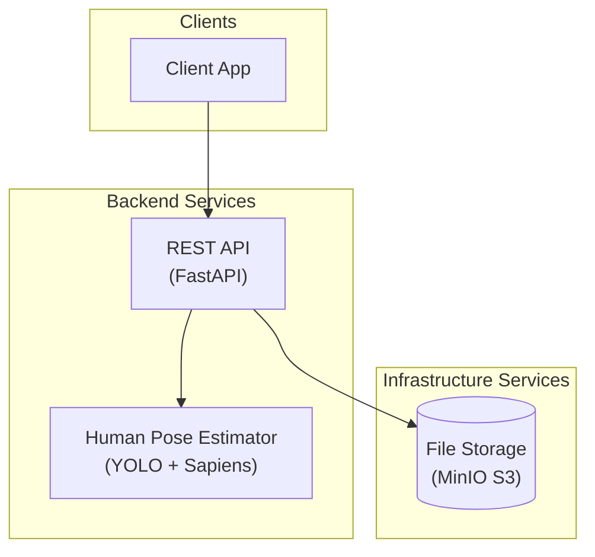

# **High-Level Component Diagram**

```mermaid
graph TB
    subgraph "Clients"
        Client["Client App"]
    end

    subgraph "Backend Services"
        API["REST API<br/>(FastAPI)"]
        HPE["Human Pose Estimator<br/>(YOLO + Sapiens)"]
    end

    subgraph "Infrastructure Services"
        S3[("File Storage<br/>(MinIO S3)")]
    end

    Client --> API
    API --> HPE
    API --> S3
```