# **I. Bucket Creation Flow**

## **Happy Path**

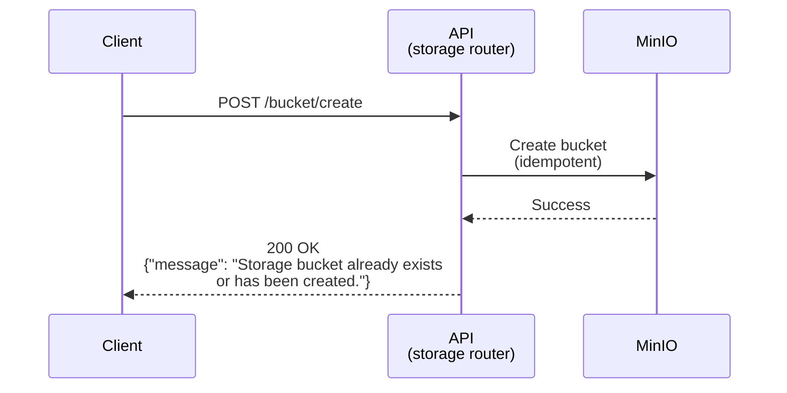
```mermaid
sequenceDiagram
    participant Client as Client
    participant API as API <br/>(storage router)
    participant MinIO as MinIO

    Client->>API: POST /bucket/create
    API->>MinIO: Create bucket <br/>(idempotent)
    MinIO-->>API:  Success
    API-->>Client: 200 OK<br/>{"message": "Storage bucket already exists <br/>or has been created."}
```

## **Failure Path**

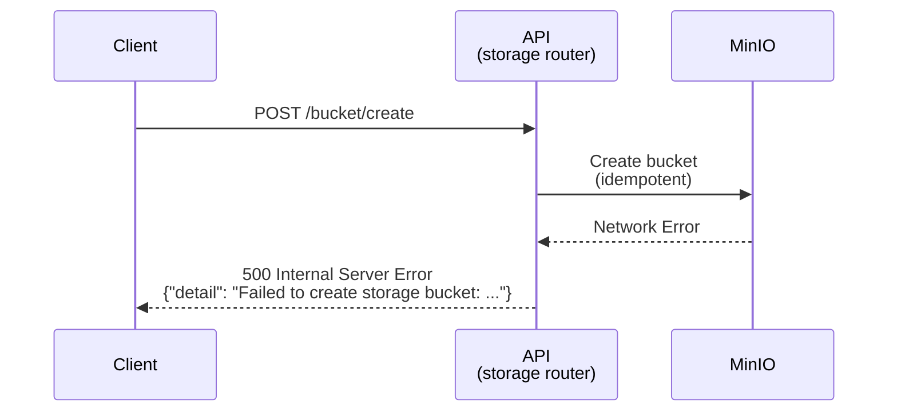
```mermaid
sequenceDiagram
    participant Client as Client
    participant API as API <br/>(storage router)
    participant MinIO as MinIO

    Client->>API: POST /bucket/create
    API->>MinIO: Create bucket <br/>(idempotent)
    MinIO-->>API:  Network Error
    API-->>Client: 500 Internal Server Error<br/>{"detail": "Failed to create storage bucket: ..."}
```

# **II. Video Upload Flow**

## **Happy Path**

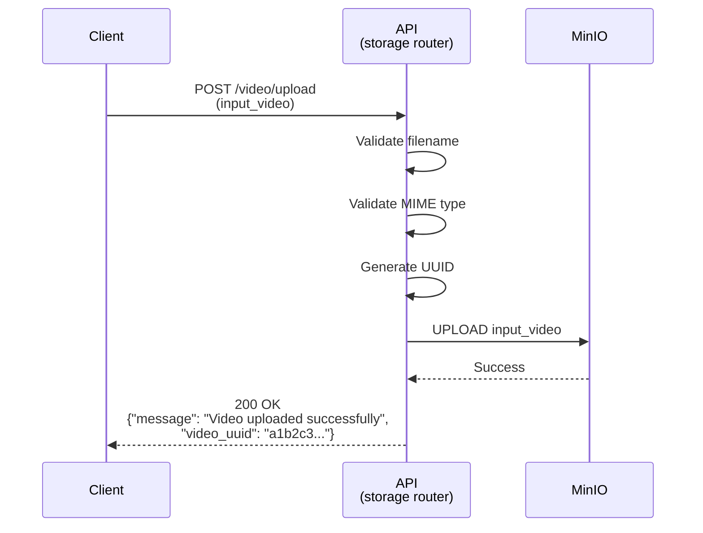
```mermaid
sequenceDiagram
    participant Client as Client
    participant API as API <br/>(storage router)
    participant MinIO as MinIO

    Client->>API: POST /video/upload<br/>(input_video)
    API->>API: Validate filename
    API->>API: Validate MIME type
    API->>API: Generate UUID
    API->>MinIO: UPLOAD input_video
    MinIO-->>API: Success
    API-->>Client: 200 OK<br/>{"message": "Video uploaded successfully",<br/>"video_uuid": "a1b2c3..."}
```

## **Failure Path 1: Missing Filename**

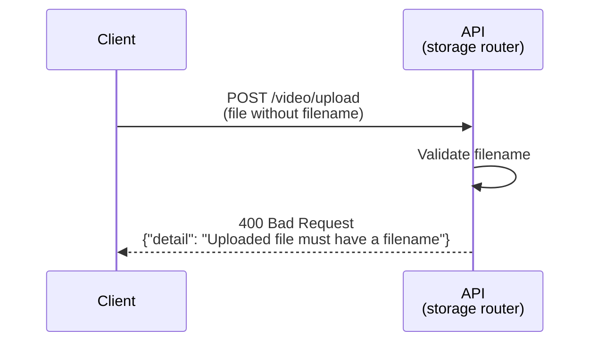
```mermaid
sequenceDiagram
    participant Client as Client
    participant API as API <br/>(storage router)

    Client->>API: POST /video/upload<br/>(file without filename)
    API->>API: Validate filename
    API-->>Client: 400 Bad Request<br/>{"detail": "Uploaded file must have a filename"}
```

## **Failure Path 2: Invalid File Type**

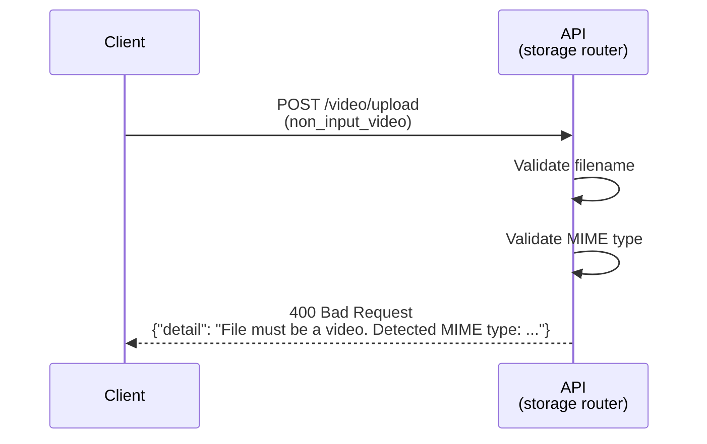
```mermaid
sequenceDiagram
    participant Client as Client
    participant API as API <br/>(storage router)

    Client->>API: POST /video/upload<br/>(non_input_video)
    API->>API: Validate filename
    API->>API: Validate MIME type
    API-->>Client: 400 Bad Request<br/>{"detail": "File must be a video. Detected MIME type: ..."}
```

## **Failure Path 3: Upload to Storage Failed**

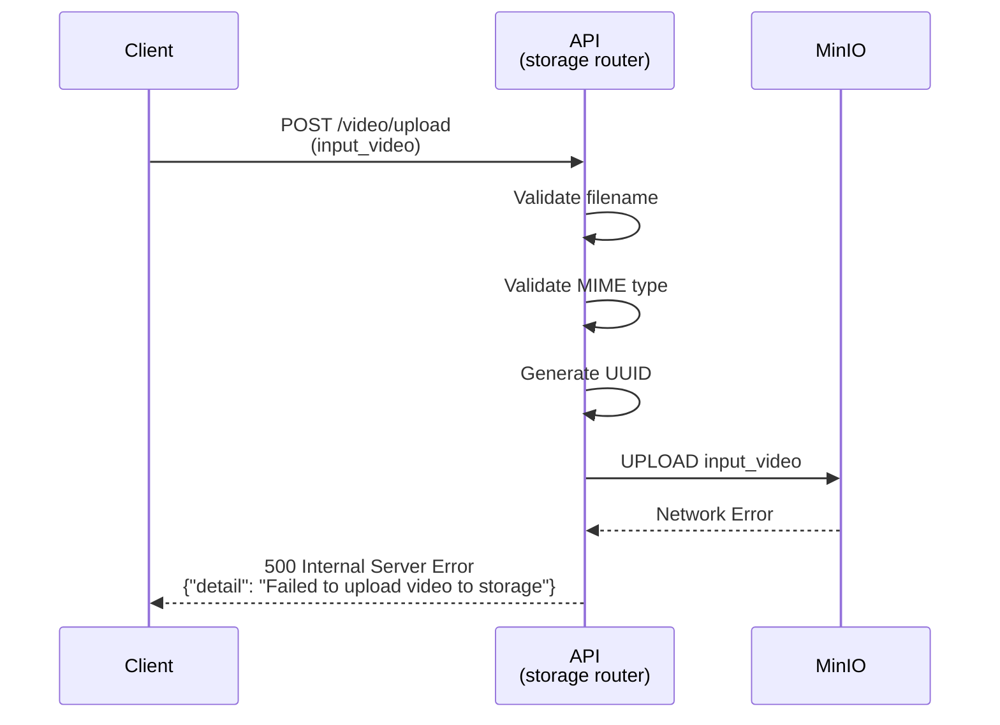
```mermaid
sequenceDiagram
    participant Client as Client
    participant API as API <br/>(storage router)
    participant MinIO as MinIO

    Client->>API: POST /video/upload<br/>(input_video)
    API->>API: Validate filename
    API->>API: Validate MIME type
    API->>API: Generate UUID
    API->>MinIO: UPLOAD input_video
    MinIO-->>API: Network Error
    API-->>Client: 500 Internal Server Error<br/>{"detail": "Failed to upload video to storage"}
```

# **III. Pose Estimation Flow**

## **Happy Path**

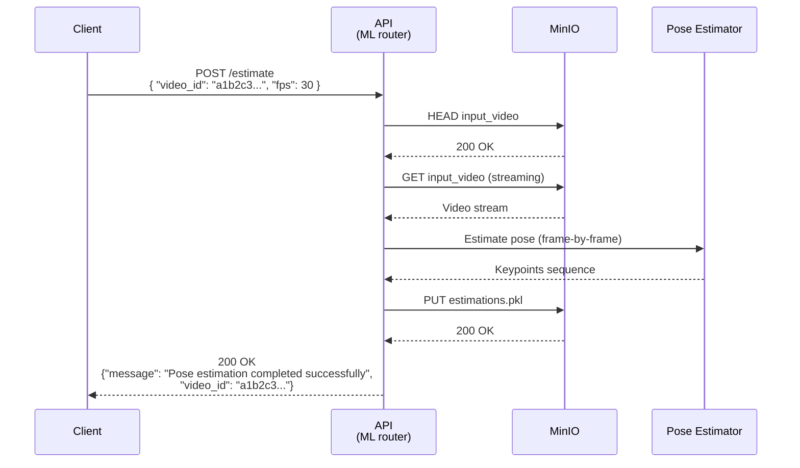
```mermaid
sequenceDiagram
    participant Client as Client
    participant API as API <br/>(ML router)
    participant MinIO as MinIO
    participant PoseEstimator as Pose Estimator

    Client->>API: POST /estimate<br/>{ "video_id": "a1b2c3...", "fps": 30 }
    API->>MinIO: HEAD input_video
    MinIO-->>API: 200 OK

    API->>MinIO: GET input_video (streaming)
    MinIO-->>API: Video stream

    API->>PoseEstimator: Estimate pose (frame-by-frame)
    PoseEstimator-->>API: Keypoints sequence

    API->>MinIO: PUT estimations.pkl
    MinIO-->>API: 200 OK

    API-->>Client: 200 OK<br/>{"message": "Pose estimation completed successfully",<br/>"video_id": "a1b2c3..."}
```

## **Failure Path 1: Input Video Not Found**

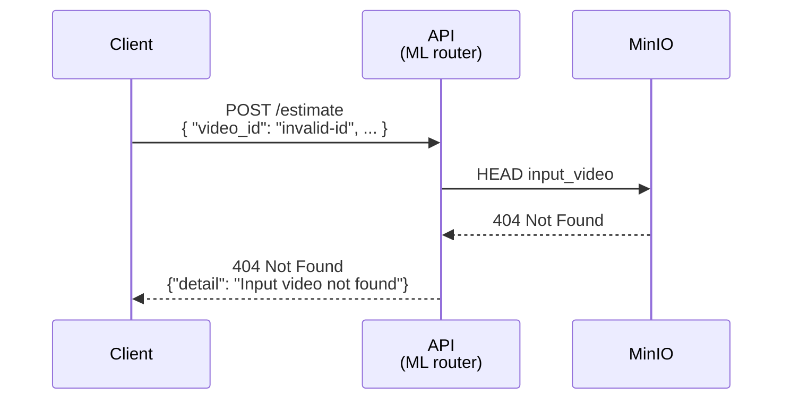
```mermaid
sequenceDiagram
    participant Client as Client
    participant API as API <br/>(ML router)
    participant MinIO as MinIO

    Client->>API: POST /estimate<br/>{ "video_id": "invalid-id", ... }
    API->>MinIO: HEAD input_video
    MinIO-->>API: 404 Not Found

    API-->>Client: 404 Not Found<br/>{"detail": "Input video not found"}
```

## **Failure Path 2: Storage Access Error**

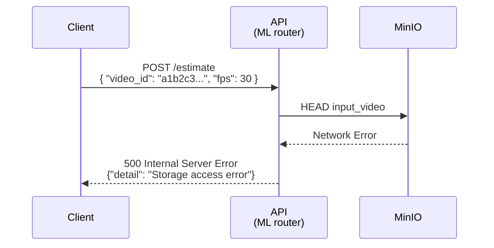
```mermaid
sequenceDiagram
    participant Client as Client
    participant API as API <br/>(ML router)
    participant MinIO as MinIO

    Client->>API: POST /estimate<br/>{ "video_id": "a1b2c3...", "fps": 30 }
    API->>MinIO: HEAD input_video
    MinIO-->>API: Network Error

    API-->>Client: 500 Internal Server Error<br/>{"detail": "Storage access error"}
```

## **Failure Path 3: Pose Estimation Crashed During Processing**

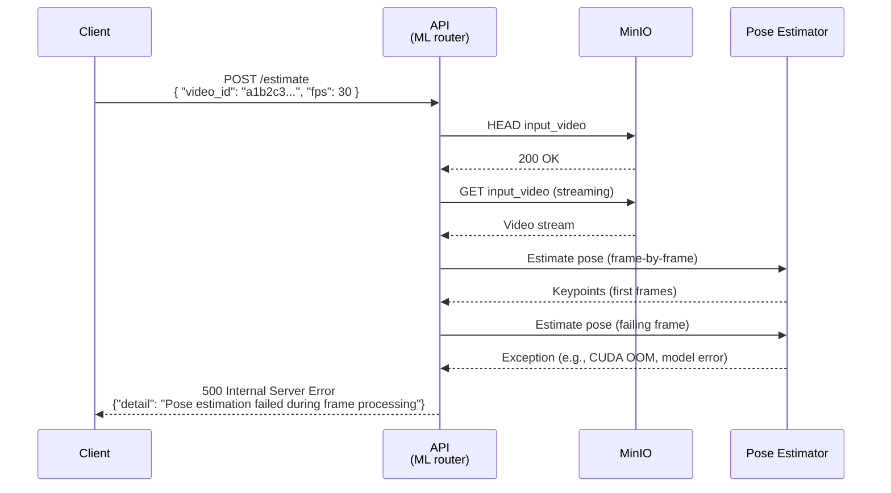
```mermaid
sequenceDiagram
    participant Client as Client
    participant API as API <br/>(ML router)
    participant MinIO as MinIO
    participant PoseEstimator as Pose Estimator

    Client->>API: POST /estimate<br/>{ "video_id": "a1b2c3...", "fps": 30 }
    API->>MinIO: HEAD input_video
    MinIO-->>API: 200 OK

    API->>MinIO: GET input_video (streaming)
    MinIO-->>API: Video stream

    API->>PoseEstimator: Estimate pose (frame-by-frame)
    PoseEstimator-->>API: Keypoints (first frames)

    API->>PoseEstimator: Estimate pose (failing frame)
    PoseEstimator-->>API: Exception (e.g., CUDA OOM, model error)

    API-->>Client: 500 Internal Server Error<br/>{"detail": "Pose estimation failed during frame processing"}
```

## **Failure Path 4: Failed to Save Results**

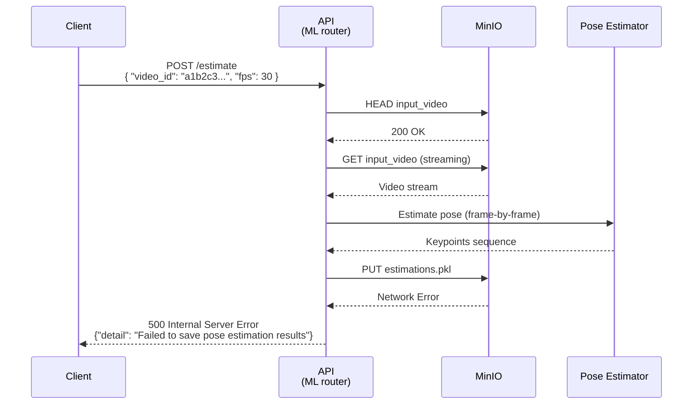
```mermaid
sequenceDiagram
    participant Client as Client
    participant API as API <br/>(ML router)
    participant MinIO as MinIO
    participant PoseEstimator as Pose Estimator

    Client->>API: POST /estimate<br/>{ "video_id": "a1b2c3...", "fps": 30 }
    API->>MinIO: HEAD input_video
    MinIO-->>API: 200 OK

    API->>MinIO: GET input_video (streaming)
    MinIO-->>API: Video stream

    API->>PoseEstimator: Estimate pose (frame-by-frame)
    PoseEstimator-->>API: Keypoints sequence

    API->>MinIO: PUT estimations.pkl
    MinIO-->>API: Network Error

    API-->>Client: 500 Internal Server Error<br/>{"detail": "Failed to save pose estimation results"}
```

# **IV. Running Analysis Flow**

## **Happy Path**

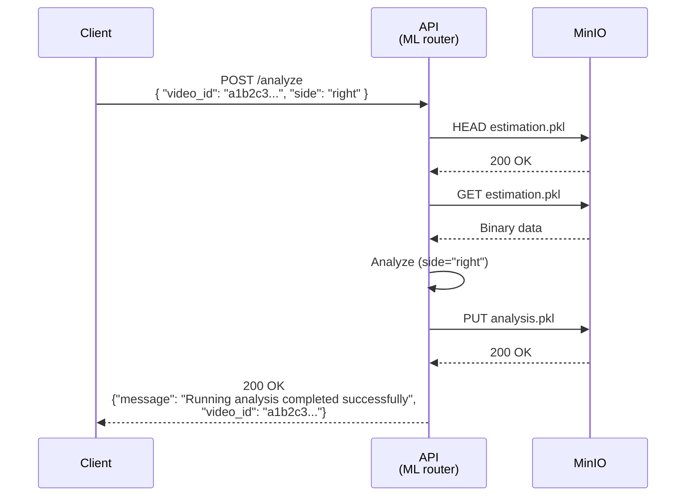
```mermaid
sequenceDiagram
    participant Client as Client
    participant API as API <br/>(ML router)
    participant MinIO as MinIO

    Client->>API: POST /analyze<br/>{ "video_id": "a1b2c3...", "side": "right" }
    API->>MinIO: HEAD estimation.pkl
    MinIO-->>API: 200 OK

    API->>MinIO: GET estimation.pkl
    MinIO-->>API: Binary data

    API->>API: Analyze (side="right")

    API->>MinIO: PUT analysis.pkl
    MinIO-->>API: 200 OK

    API-->>Client: 200 OK<br/>{"message": "Running analysis completed successfully",<br/>"video_id": "a1b2c3..."}
```

## **Failure Path 1: Pose Estimation Results Not Found**

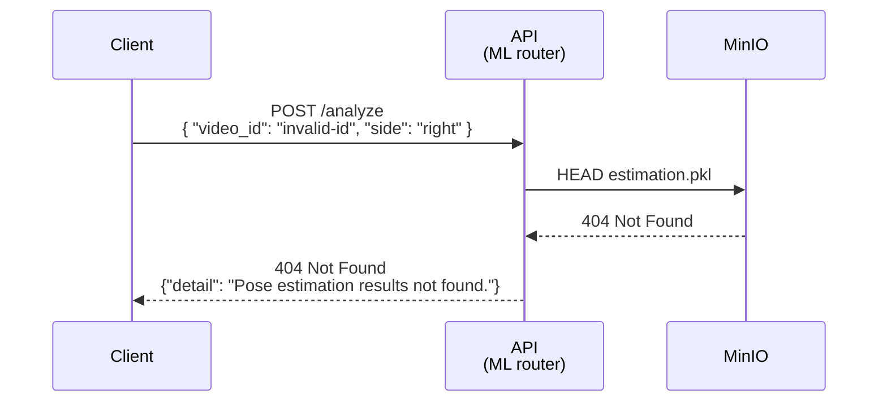
```mermaid
sequenceDiagram
    participant Client as Client
    participant API as API <br/>(ML router)
    participant MinIO as MinIO

    Client->>API: POST /analyze<br/>{ "video_id": "invalid-id", "side": "right" }
    API->>MinIO: HEAD estimation.pkl
    MinIO-->>API: 404 Not Found

    API-->>Client: 404 Not Found<br/>{"detail": "Pose estimation results not found."}
```

## **Failure Path 2: Storage Access Error (e.g., MinIO down)**

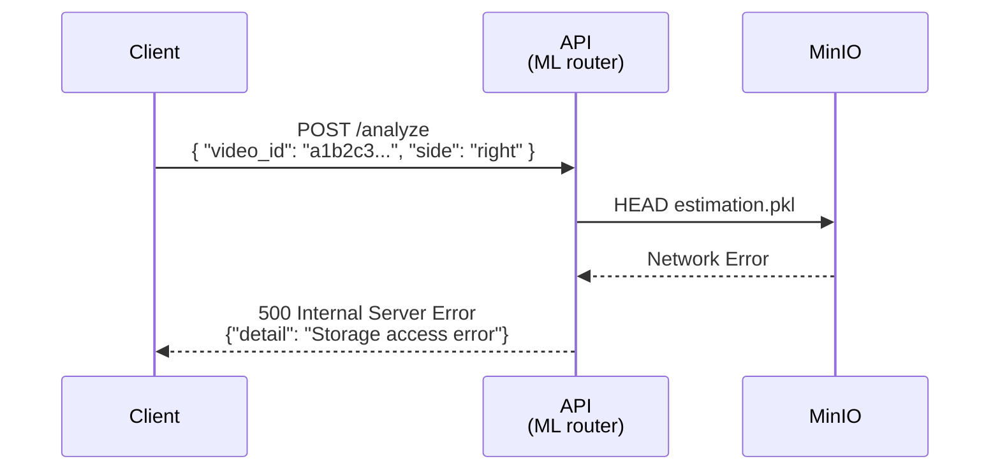
```mermaid
sequenceDiagram
    participant Client as Client
    participant API as API <br/>(ML router)
    participant MinIO as MinIO

    Client->>API: POST /analyze<br/>{ "video_id": "a1b2c3...", "side": "right" }
    API->>MinIO: HEAD estimation.pkl
    MinIO-->>API: Network Error

    API-->>Client: 500 Internal Server Error<br/>{"detail": "Storage access error"}
```

## **Failure Path 3: Failed to Load Estimation Results**

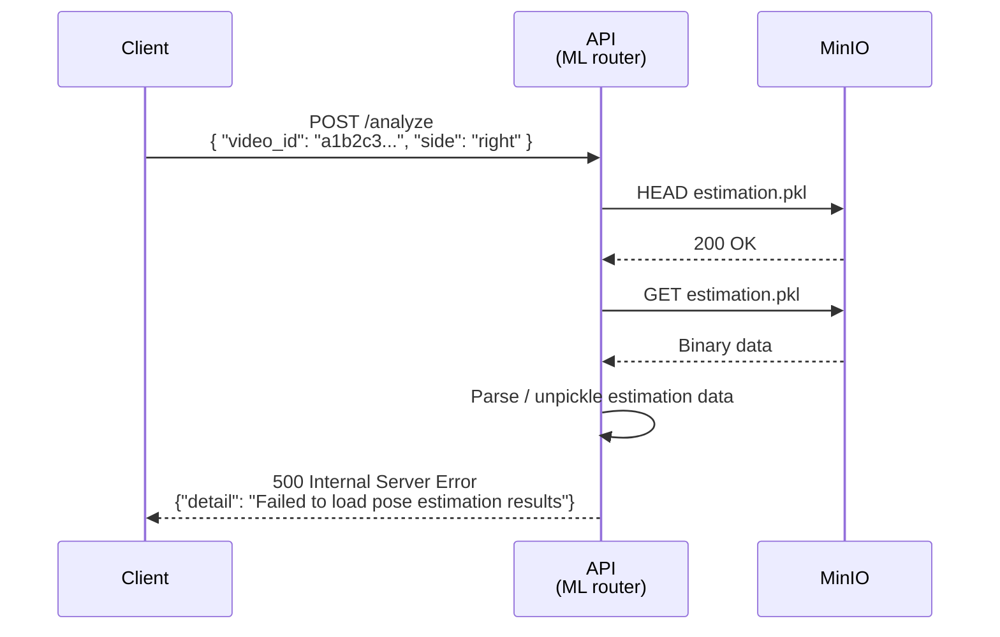
```mermaid
sequenceDiagram
    participant Client as Client
    participant API as API <br/>(ML router)
    participant MinIO as MinIO

    Client->>API: POST /analyze<br/>{ "video_id": "a1b2c3...", "side": "right" }
    API->>MinIO: HEAD estimation.pkl
    MinIO-->>API: 200 OK

    API->>MinIO: GET estimation.pkl
    MinIO-->>API: Binary data

    API->>API: Parse / unpickle estimation data
    API-->>Client: 500 Internal Server Error<br/>{"detail": "Failed to load pose estimation results"}
```

## **Failure Path 4: Running Analysis Failed**

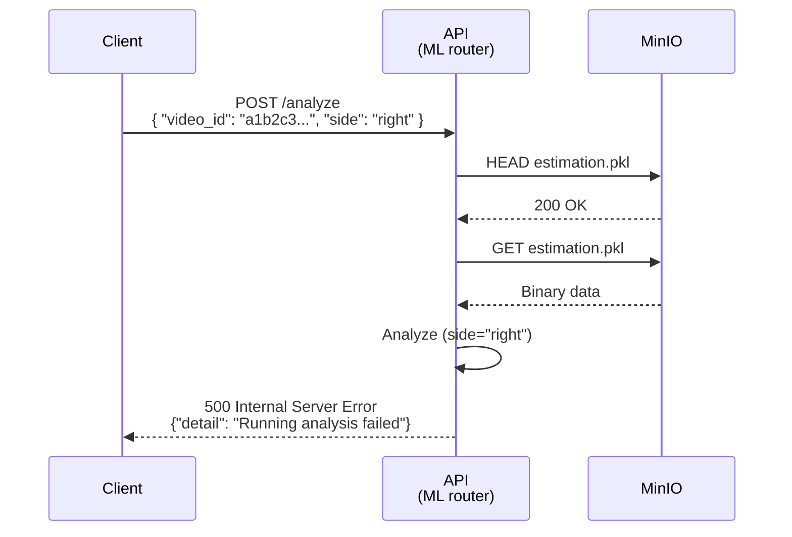
```mermaid
sequenceDiagram
    participant Client as Client
    participant API as API <br/>(ML router)
    participant MinIO as MinIO

    Client->>API: POST /analyze<br/>{ "video_id": "a1b2c3...", "side": "right" }
    API->>MinIO: HEAD estimation.pkl
    MinIO-->>API: 200 OK

    API->>MinIO: GET estimation.pkl
    MinIO-->>API: Binary data

    API->>API: Analyze (side="right")
    API-->>Client: 500 Internal Server Error<br/>{"detail": "Running analysis failed"}
```

## **Failure Path 5: Failed to Save Analysis Results**

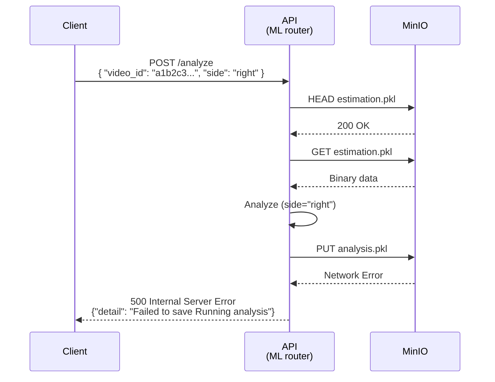
```mermaid
sequenceDiagram
    participant Client as Client
    participant API as API <br/>(ML router)
    participant MinIO as MinIO

    Client->>API: POST /analyze<br/>{ "video_id": "a1b2c3...", "side": "right" }
    API->>MinIO: HEAD estimation.pkl
    MinIO-->>API: 200 OK

    API->>MinIO: GET estimation.pkl
    MinIO-->>API: Binary data

    API->>API: Analyze (side="right")

    API->>MinIO: PUT analysis.pkl
    MinIO-->>API: Network Error

    API-->>Client: 500 Internal Server Error<br/>{"detail": "Failed to save Running analysis"}
```

# **V. Video Rendering Flow**

## **Happy Path**

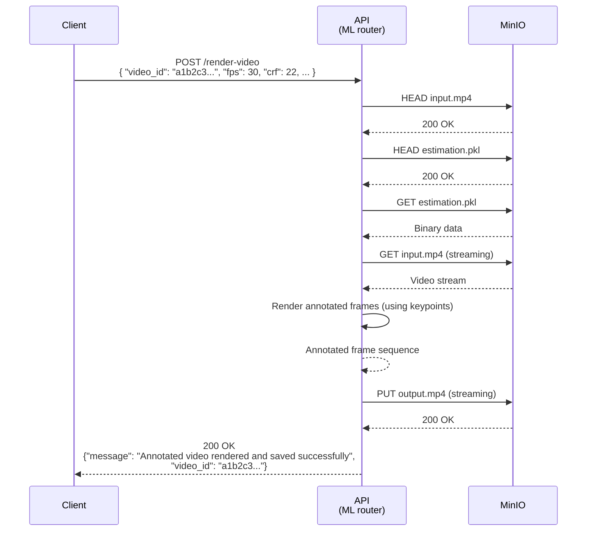
```mermaid
sequenceDiagram
    participant Client as Client
    participant API as API <br/>(ML router)
    participant MinIO as MinIO

    Client->>API: POST /render-video<br/>{ "video_id": "a1b2c3...", "fps": 30, "crf": 22, ... }
    
    API->>MinIO: HEAD input.mp4
    MinIO-->>API: 200 OK

    API->>MinIO: HEAD estimation.pkl
    MinIO-->>API: 200 OK

    API->>MinIO: GET estimation.pkl
    MinIO-->>API: Binary data

    API->>MinIO: GET input.mp4 (streaming)
    MinIO-->>API: Video stream

    API->>API: Render annotated frames (using keypoints)
    API-->>API: Annotated frame sequence

    API->>MinIO: PUT output.mp4 (streaming)
    MinIO-->>API: 200 OK

    API-->>Client: 200 OK<br/>{"message": "Annotated video rendered and saved successfully",<br/>"video_id": "a1b2c3..."}
```

## **Failure Path 1: Input Video Not Found**

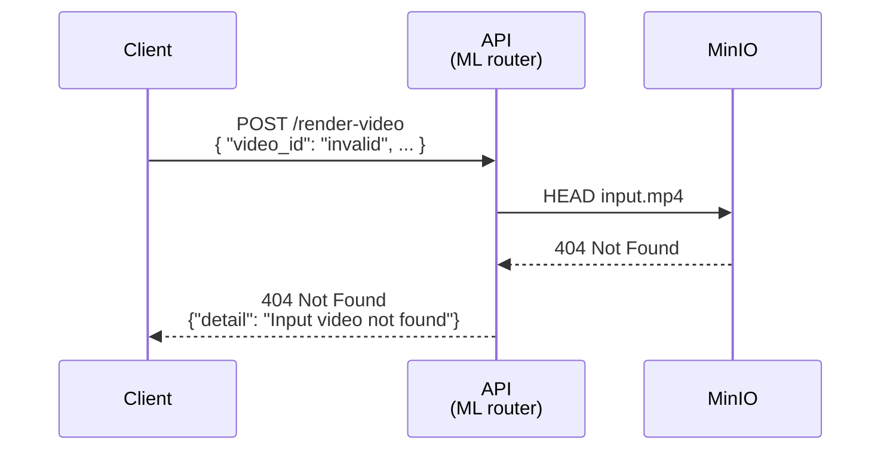
```mermaid
sequenceDiagram
    participant Client as Client
    participant API as API <br/>(ML router)
    participant MinIO as MinIO

    Client->>API: POST /render-video<br/>{ "video_id": "invalid", ... }
    API->>MinIO: HEAD input.mp4
    MinIO-->>API: 404 Not Found

    API-->>Client: 404 Not Found<br/>{"detail": "Input video not found"}
```

## **Failure Path 2: Pose Estimation Results Not Found**

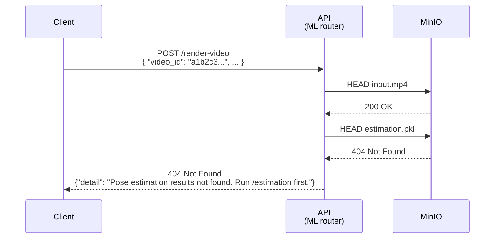
```mermaid
sequenceDiagram
    participant Client as Client
    participant API as API <br/>(ML router)
    participant MinIO as MinIO

    Client->>API: POST /render-video<br/>{ "video_id": "a1b2c3...", ... }
    API->>MinIO: HEAD input.mp4
    MinIO-->>API: 200 OK

    API->>MinIO: HEAD estimation.pkl
    MinIO-->>API: 404 Not Found

    API-->>Client: 404 Not Found<br/>{"detail": "Pose estimation results not found. Run /estimation first."}
```

## **Failure Path 3: Empty Input Video**

```mermaid
sequenceDiagram
    participant Client as Client
    participant API as API <br/>(ML router)
    participant MinIO as MinIO

    Client->>API: POST /render-video<br/>{ "video_id": "a1b2c3...", ... }
    API->>MinIO: HEAD input.mp4
    MinIO-->>API: 200 OK

    API->>MinIO: HEAD estimation.pkl
    MinIO-->>API: 200 OK

    API->>MinIO: GET input.mp4 (streaming)
    MinIO-->>API: Video stream

    API->>API: Attempt to read first frame
    API-->>Client: 400 Bad Request<br/>{"detail": "Input video contains no frames"}
```

## **Failure Path 4: Rendering or Encoding Failed**

```mermaid
sequenceDiagram
    participant Client as Client
    participant API as API <br/>(ML router)
    participant MinIO as MinIO

    Client->>API: POST /render-video<br/>{ "video_id": "a1b2c3...", ... }
    API->>MinIO: HEAD input.mp4
    MinIO-->>API: 200 OK

    API->>MinIO: HEAD estimation.pkl
    MinIO-->>API: 200 OK

    API->>MinIO: GET estimation.pkl
    MinIO-->>API: Binary data

    API->>MinIO: GET input.mp4 (streaming)
    MinIO-->>API: Video stream

    API->>API: Render or encode annotated video
    API-->>Client: 500 Internal Server Error<br/>{"detail": "Failed to render or encode annotated video"}
```

# **VI. Analysis Download Flow**

## **Happy Path**

```mermaid
sequenceDiagram
    participant Client as Client
    participant API as API <br/>(storage router)
    participant MinIO as MinIO

    Client->>API: GET /analysis/a1b2c3.../download
    API->>MinIO: GET analysis.pkl
    MinIO-->>API: Binary data (pickle)

    API->>API: Parse and convert analysis to dict
    API-->>Client: 200 OK<br/>{ "joint_angles": {...}, "arm_swing": {...}, ... }
```

## **Failure Path 1: Analysis Results Not Found**

```mermaid
sequenceDiagram
    participant Client as Client
    participant API as API <br/>(storage router)
    participant MinIO as MinIO

    Client->>API: GET /analysis/invalid-id/download
    API->>MinIO: GET analysis.pkl
    MinIO-->>API: 404 Not Found

    API-->>Client: 404 Not Found<br/>{"detail": "Analysis results not found"}
```

## **Failure Path 2: Storage Unreachable or Corrupted Data**

```mermaid
sequenceDiagram
    participant Client as Client
    participant API as API <br/>(storage router)
    participant MinIO as MinIO

    Client->>API: GET /analysis/a1b2c3.../download
    API->>MinIO: GET analysis.pkl

    alt Storage unreachable
        MinIO-->>API: Network Error
    else Corrupted data
        MinIO-->>API: Binary data (invalid/corrupted)
        API->>API: Attempt to parse pickle → fails
    end

    API-->>Client: 500 Internal Server Error<br/>{"detail": "Failed to load or parse analysis results"}
```

# **VII. Video Download Flow**

## **Happy Path**

```mermaid
sequenceDiagram
    participant Client as Client
    participant API as API <br/>(storage router)
    participant MinIO as MinIO

    Client->>API: GET /video/a1b2c3.../download
    API->>MinIO: HEAD output.mp4
    MinIO-->>API: 200 OK

    API->>MinIO: Generate presigned URL
    MinIO-->>API: Presigned URL

    API->>MinIO: Stream video via presigned URL
    MinIO-->>Client: StreamingResponse<br/>(media_type="video/mp4")
```

## **Failure Path 1: Output Video Not Found**

```mermaid
sequenceDiagram
    participant Client as Client
    participant API as API <br/>(storage router)
    participant MinIO as MinIO

    Client->>API: GET /video/invalid-id/download
    API->>MinIO: HEAD output.mp4
    MinIO-->>API: 404 Not Found

    API-->>Client: 404 Not Found<br/>{"detail": "Output video not found"}
```

## **Failure Path 2: Storage Unreachable During Existence Check**

```mermaid
sequenceDiagram
    participant Client as Client
    participant API as API <br/>(storage router)
    participant MinIO as MinIO

    Client->>API: GET /video/a1b2c3.../download
    API->>MinIO: HEAD output.mp4
    MinIO-->>API: Network Error

    API-->>Client: 500 Internal Server Error<br/>{"detail": "Storage access error"}
```

## **Failure Path 3: Failed to Generate Presigned URL**

```mermaid
sequenceDiagram
    participant Client as Client
    participant API as API <br/>(storage router)
    participant MinIO as MinIO

    Client->>API: GET /video/a1b2c3.../download
    API->>MinIO: HEAD output.mp4
    MinIO-->>API: 200 OK

    API->>MinIO: Generate presigned URL
    MinIO-->>API: Error (e.g., auth misconfig, internal)

    API-->>Client: 500 Internal Server Error<br/>{"detail": "Failed to generate download link"}
```

# **VIII. Artifacts Deletion Flow**

## **Happy Path (All or Some Artifacts Deleted)**

```mermaid
sequenceDiagram
    participant Client as Client
    participant API as API <br/>(storage router)
    participant MinIO as MinIO

    Client->>API: DELETE /artifacts/a1b2c3.../delete
    API->>MinIO: DELETE input.mp4<br/>(ignored if not found)
    MinIO-->>API: 204 No Content

    API->>MinIO: DELETE output.mp4<br/>(ignored if not found)
    MinIO-->>API: 204 No Content

    API->>MinIO: DELETE estimation.pkl<br/>(ignored if not found)
    MinIO-->>API: 204 No Content

    API->>MinIO: DELETE analysis.pkl<br/>(ignored if not found)
    MinIO-->>API: 204 No Content

    API-->>Client: 204 No Content
```

## **Failure Path: Deletion Failed**

```mermaid
sequenceDiagram
    participant Client as Client
    participant API as API <br/>(storage router)
    participant MinIO as MinIO

    Client->>API: DELETE /artifacts/a1b2c3.../delete
    API->>MinIO: DELETE input.mp4
    MinIO-->>API: Network Error

    API-->>Client: 500 Internal Server Error<br/>{"detail": "Failed to delete video artifacts"}
```